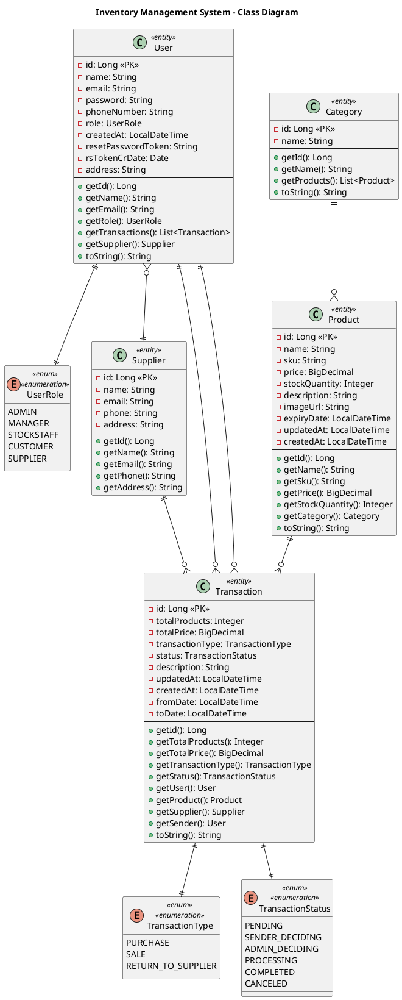

# Biểu đồ lớp - Hệ thống Quản lý Kho hàng (Inventory Management System)

## Mô tả
Biểu đồ lớp này mô tả cấu trúc dữ liệu và mối quan hệ giữa các entity trong hệ thống quản lý kho hàng, bao gồm: User, Product, Category, Supplier, Transaction cùng với các enum và ràng buộc dữ liệu.

## Class Diagram - Toàn bộ hệ thống



## Detailed Entity Relationships

### 1. **User ↔ Transaction Relationships**
```sql
-- User as transaction performer
User (1) ←→ (N) Transaction [user_id]

-- User as transaction sender (for returns/transfers)  
User (1) ←→ (N) Transaction [sender_id]
```

### 2. **Product ↔ Category Relationship**
```sql
-- Each product belongs to exactly one category
Category (1) ←→ (N) Product [category_id]
```

### 3. **Transaction Relationships**
```sql
-- Transaction involves one product
Product (1) ←→ (N) Transaction [product_id]

-- Transaction may involve supplier (for purchases/returns)
Supplier (1) ←→ (N) Transaction [supplier_id]
```

### 4. **User ↔ Supplier Relationship**
```sql
-- Supplier users are linked to supplier entity
Supplier (1) ←→ (N) User [supplier_id]
```

## Database Schema Mapping

### Table Structure
```sql
-- Categories Table
CREATE TABLE categories (
    id BIGINT PRIMARY KEY AUTO_INCREMENT,
    name VARCHAR(255) NOT NULL UNIQUE
);

-- Suppliers Table  
CREATE TABLE suppliers (
    id BIGINT PRIMARY KEY AUTO_INCREMENT,
    name VARCHAR(255) NOT NULL,
    email VARCHAR(255),
    phone VARCHAR(255),
    address TEXT
);

-- Users Table
CREATE TABLE users (
    id BIGINT PRIMARY KEY AUTO_INCREMENT,
    name VARCHAR(255) NOT NULL,
    email VARCHAR(255) NOT NULL UNIQUE,
    password VARCHAR(255) NOT NULL,
    phone_number VARCHAR(255) NOT NULL,
    role VARCHAR(50) NOT NULL,
    created_at TIMESTAMP DEFAULT CURRENT_TIMESTAMP,
    reset_password_token VARCHAR(255),
    resetToken_created_date TIMESTAMP,
    address TEXT,
    supplier_id BIGINT,
    FOREIGN KEY (supplier_id) REFERENCES suppliers(id)
);

-- Products Table
CREATE TABLE products (
    id BIGINT PRIMARY KEY AUTO_INCREMENT,
    name VARCHAR(255) NOT NULL,
    sku VARCHAR(255) NOT NULL UNIQUE,
    price DECIMAL(10,2) NOT NULL CHECK (price > 0),
    stock_quantity INT NOT NULL CHECK (stock_quantity >= 0),
    description TEXT,
    image_url VARCHAR(500),
    expiry_date TIMESTAMP,
    updated_at TIMESTAMP,
    created_at TIMESTAMP DEFAULT CURRENT_TIMESTAMP,
    category_id BIGINT NOT NULL,
    FOREIGN KEY (category_id) REFERENCES categories(id)
);

-- Transactions Table
CREATE TABLE transactions (
    id BIGINT PRIMARY KEY AUTO_INCREMENT,
    total_products INT,
    total_price DECIMAL(12,2),
    transaction_type VARCHAR(50) NOT NULL,
    status VARCHAR(50) NOT NULL,
    description TEXT,
    updated_at TIMESTAMP,
    created_at TIMESTAMP DEFAULT CURRENT_TIMESTAMP,
    user_id BIGINT,
    product_id BIGINT,
    supplier_id BIGINT,
    sender_id BIGINT,
    FOREIGN KEY (user_id) REFERENCES users(id),
    FOREIGN KEY (product_id) REFERENCES products(id),
    FOREIGN KEY (supplier_id) REFERENCES suppliers(id),
    FOREIGN KEY (sender_id) REFERENCES users(id)
);
```

## Business Rules và Constraints

### 1. **User Entity Rules**
- **Unique Constraints**: Email must be system-wide unique
- **Required Fields**: Name, email, password, phone number are mandatory
- **Role-based Access**: Different permissions based on UserRole enum
- **Supplier Linking**: SUPPLIER role users must be linked to Supplier entity
- **Password Security**: Passwords must be hashed before storage

### 2. **Product Entity Rules**
- **SKU Uniqueness**: Stock Keeping Unit must be unique across all products
- **Price Validation**: Must be positive value, no free or negative-priced items
- **Stock Management**: Quantity cannot go below zero
- **Category Dependency**: Every product must belong to a valid category
- **Image Management**: Optional image URL for product display

### 3. **Category Entity Rules**
- **Name Uniqueness**: Category names must be unique
- **Deletion Protection**: Cannot delete category if products exist
- **Product Organization**: Provides hierarchical product classification

### 4. **Transaction Entity Rules**
- **Type-based Logic**: 
  - PURCHASE: Customer buys products (stock decreases)
  - SALE: Business sells to external customer
  - RETURN_TO_SUPPLIER: Return defective/excess items
- **Status Workflow**: 
  - PENDING → SENDER_DECIDING → ADMIN_DECIDING → PROCESSING → COMPLETED/CANCELED
- **User Relationships**: 
  - `user`: The person performing the transaction
  - `sender`: Who initiated (relevant for returns/transfers)
- **Financial Tracking**: Total price and product count for reporting

### 5. **Supplier Entity Rules**
- **Contact Management**: Name is required, other fields optional
- **User Association**: Can have multiple users associated (supplier staff)
- **Transaction Integration**: Linked to purchase and return transactions

## Key Design Patterns

### 1. **Entity Relationships**
- **One-to-Many**: User→Transactions, Category→Products, Supplier→Transactions
- **Many-to-One**: Product→Category, User→Supplier, Transaction→User/Product/Supplier
- **Enum Associations**: User→UserRole, Transaction→TransactionType/Status

### 2. **Data Integrity**
- **Foreign Key Constraints**: Maintain referential integrity
- **Unique Constraints**: Prevent duplicate emails, SKUs, category names
- **Check Constraints**: Ensure positive prices, non-negative stock
- **Not Null Constraints**: Enforce required business fields

### 3. **Audit Trail**
- **Timestamps**: createdAt (auto), updatedAt (manual)
- **User Tracking**: Who performed transactions
- **Status History**: Transaction status progression
- **Immutable Records**: Created timestamps are final

### 4. **Extensibility**
- **Enum Values**: Easy to add new user roles, transaction types, statuses
- **Optional Fields**: Flexible data model with nullable columns
- **Relationship Expansion**: Ready for additional entities (OrderItems, Categories hierarchy)

## Security Considerations

### 1. **Data Protection**
- **Password Hashing**: Never store plain text passwords
- **Token Management**: Reset password tokens with expiration
- **Role-based Security**: Enum-driven access control
- **Input Validation**: Annotation-based validation (@NotBlank, @Positive, @Min)

### 2. **Business Logic Enforcement**
- **Constraint Validation**: Database-level and application-level checks
- **Transaction Integrity**: Atomic operations for stock updates
- **User Role Separation**: Clear separation of concerns by role
- **Audit Compliance**: Complete transaction history tracking

Biểu đồ này cung cấp cái nhìn toàn diện về cấu trúc dữ liệu của hệ thống Inventory Management, bao gồm tất cả các entity, relationships, constraints và business rules quan trọng!

---

# Bảng dữ liệu có quan hệ (Database Tables Structure)

## 1. Bảng Users (Người dùng)

| Tên cột | Kiểu dữ liệu | Null | Ràng buộc | Mô tả |
|----------|--------------|------|-----------|--------|
| id | BIGINT(20) | No | Primary Key, Auto Increment | Mã định danh người dùng |
| created_at | DATETIME(6) | Yes | - | Thời gian tạo tài khoản |
| email | VARCHAR(255) | No | Unique Key | Email đăng nhập (duy nhất) |
| name | VARCHAR(255) | No | Not Null | Tên đầy đủ người dùng |
| password | VARCHAR(255) | No | Not Null | Mật khẩu đã mã hóa |
| phone_number | VARCHAR(255) | No | Not Null | Số điện thoại liên hệ |
| role | ENUM | Yes | 'ADMIN','MANAGER','SUPPLIER','CUSTOMER','STOCKSTAFF' | Vai trò hệ thống |
| address | VARCHAR(255) | Yes | UTF8 Charset | Địa chỉ liên hệ |
| reset_password_token | VARCHAR(255) | Yes | UTF8 Charset | Token đặt lại mật khẩu |
| token_created_date | DATE | Yes | - | Ngày tạo token (deprecated) |
| reset_token_created_date | DATETIME(6) | Yes | - | Thời gian tạo token đặt lại |
| supplier_id | BIGINT(20) | Yes | Foreign Key → suppliers(id) | Liên kết với nhà cung cấp |

**Indexes:**
- `PRIMARY KEY (id)`
- `UNIQUE KEY UK6dotkott2kjsp8vw4d0m25fb7 (email)`
- `KEY FKhptydrocfmpyv0pjmbmuc1yhx (supplier_id)`

**Foreign Keys:**
- `supplier_id` REFERENCES `suppliers(id)`

---

## 2. Bảng Suppliers (Nhà cung cấp)

| Tên cột | Kiểu dữ liệu | Null | Ràng buộc | Mô tả |
|----------|--------------|------|-----------|--------|
| id | BIGINT(20) | No | Primary Key, Auto Increment | Mã định danh nhà cung cấp |
| email | VARCHAR(255) | Yes | - | Email liên hệ nhà cung cấp |
| phone | VARCHAR(255) | Yes | - | Số điện thoại nhà cung cấp |
| address | VARCHAR(255) | Yes | - | Địa chỉ nhà cung cấp |
| name | VARCHAR(255) | No | Not Null | Tên nhà cung cấp |

**Indexes:**
- `PRIMARY KEY (id)`

**Relationships:**
- **1:N** với `users` table (một supplier có nhiều users)
- **1:N** với `transactions` table (một supplier có nhiều giao dịch)

---

## 3. Bảng Categories (Danh mục sản phẩm)

| Tên cột | Kiểu dữ liệu | Null | Ràng buộc | Mô tả |
|----------|--------------|------|-----------|--------|
| id | BIGINT(20) | No | Primary Key, Auto Increment | Mã định danh danh mục |
| name | VARCHAR(255) | No | Not Null, Unique Key | Tên danh mục (duy nhất) |

**Indexes:**
- `PRIMARY KEY (id)`
- `UNIQUE KEY UKt8o6pivur7nn124jehx7cygw5 (name)`

**Relationships:**
- **1:N** với `products` table (một category có nhiều products)

---

## 4. Bảng Products (Sản phẩm)

| Tên cột | Kiểu dữ liệu | Null | Ràng buộc | Mô tả |
|----------|--------------|------|-----------|--------|
| id | BIGINT(20) | No | Primary Key, Auto Increment | Mã định danh sản phẩm |
| created_at | DATETIME(6) | Yes | - | Thời gian tạo sản phẩm |
| description | VARCHAR(255) | Yes | - | Mô tả chi tiết sản phẩm |
| expiry_date | DATETIME(6) | Yes | - | Ngày hết hạn sản phẩm |
| image_url | VARCHAR(255) | Yes | - | Đường dẫn hình ảnh sản phẩm |
| name | VARCHAR(255) | No | Not Null | Tên sản phẩm |
| price | DECIMAL(38,2) | Yes | Must be positive | Giá bán sản phẩm |
| sku | VARCHAR(255) | No | Not Null, Unique Key | Mã SKU sản phẩm (duy nhất) |
| stock_quantity | INT(11) | Yes | Must be >= 0 | Số lượng tồn kho |
| updated_at | DATETIME(6) | Yes | - | Thời gian cập nhật cuối |
| category_id | BIGINT(20) | Yes | Foreign Key → categories(id) | Liên kết với danh mục |

**Indexes:**
- `PRIMARY KEY (id)`
- `UNIQUE KEY UKfhmd06dsmj6k0n90swsh8ie9g (sku)`
- `KEY FKog2rp4qthbtt2lfyhfo32lsw9 (category_id)`

**Foreign Keys:**
- `category_id` REFERENCES `categories(id)`

**Business Rules:**
- `price` must be positive value
- `stock_quantity` cannot be negative
- `sku` must be unique across all products

---

## 5. Bảng Transactions (Giao dịch)

| Tên cột | Kiểu dữ liệu | Null | Ràng buộc | Mô tả |
|----------|--------------|------|-----------|--------|
| id | BIGINT(20) | No | Primary Key, Auto Increment | Mã định danh giao dịch |
| created_at | DATETIME(6) | Yes | - | Thời gian tạo giao dịch |
| description | VARCHAR(255) | Yes | - | Mô tả giao dịch |
| status | ENUM | Yes | 'CANCELED','COMPLETED','PENDING','PROCESSING','SENDER_DECIDING','ADMIN_DECIDING' | Trạng thái giao dịch |
| total_price | DECIMAL(38,2) | Yes | - | Tổng giá trị giao dịch |
| total_products | INT(11) | Yes | - | Tổng số lượng sản phẩm |
| transaction_type | ENUM | Yes | 'PURCHASE','RETURN_TO_SUPPLIER','SALE' | Loại giao dịch |
| updated_at | DATETIME(6) | Yes | - | Thời gian cập nhật cuối |
| product_id | BIGINT(20) | Yes | Foreign Key → products(id) | Sản phẩm trong giao dịch |
| supplier_id | BIGINT(20) | Yes | Foreign Key → suppliers(id) | Nhà cung cấp (nếu có) |
| user_id | BIGINT(20) | Yes | Foreign Key → users(id) | Người thực hiện giao dịch |
| sender_id | BIGINT(20) | Yes | Foreign Key → users(id) | Người gửi (đối với return) |

**Indexes:**
- `PRIMARY KEY (id)`
- `KEY FKcdpkn7bkq15bjvlw9mo46l9ft (product_id)`
- `KEY FKih7q8ly56miqunee4xnylu4i9 (supplier_id)`
- `KEY FKqwv7rmvc8va8rep7piikrojds (user_id)`
- `KEY FK3ly4r8r6ubt0blftudix2httv (sender_id)`

**Foreign Keys:**
- `product_id` REFERENCES `products(id)`
- `supplier_id` REFERENCES `suppliers(id)`
- `user_id` REFERENCES `users(id)`
- `sender_id` REFERENCES `users(id)`

**Business Rules:**
- **PURCHASE**: Khách hàng mua sản phẩm từ hệ thống
- **SALE**: Hệ thống bán cho khách hàng bên ngoài
- **RETURN_TO_SUPPLIER**: Trả hàng lại cho nhà cung cấp

---

# Mối quan hệ giữa các bảng (Table Relationships)

## Sơ đồ quan hệ Entity Relationship (ERD)

```
SUPPLIERS (1) ←→ (N) USERS [supplier_id]
    ↓ (1:N)
TRANSACTIONS
    ↑ (N:1)
USERS (1) ←→ (N) TRANSACTIONS [user_id, sender_id]
    
CATEGORIES (1) ←→ (N) PRODUCTS [category_id]
    
PRODUCTS (1) ←→ (N) TRANSACTIONS [product_id]
```

## Chi tiết quan hệ

### 1. **USERS ↔ SUPPLIERS** (Many-to-One)
- **Mối quan hệ**: N:1 (Nhiều users thuộc về 1 supplier)
- **Foreign Key**: `users.supplier_id` → `suppliers.id`
- **Business Logic**: User có role 'SUPPLIER' sẽ được liên kết với supplier entity

### 2. **CATEGORIES ↔ PRODUCTS** (One-to-Many)
- **Mối quan hệ**: 1:N (1 category có nhiều products)
- **Foreign Key**: `products.category_id` → `categories.id`
- **Business Logic**: Mỗi product phải thuộc về 1 category

### 3. **USERS ↔ TRANSACTIONS** (One-to-Many)
- **Mối quan hệ**: 1:N (1 user có nhiều transactions)
- **Foreign Keys**: 
  - `transactions.user_id` → `users.id` (người thực hiện)
  - `transactions.sender_id` → `users.id` (người gửi - cho return)
- **Business Logic**: Track both transaction performer và sender

### 4. **PRODUCTS ↔ TRANSACTIONS** (One-to-Many)
- **Mối quan hệ**: 1:N (1 product có nhiều transactions)
- **Foreign Key**: `transactions.product_id` → `products.id`
- **Business Logic**: Track tất cả transactions của mỗi product

### 5. **SUPPLIERS ↔ TRANSACTIONS** (One-to-Many)
- **Mối quan hệ**: 1:N (1 supplier có nhiều transactions)
- **Foreign Key**: `transactions.supplier_id` → `suppliers.id`
- **Business Logic**: Chỉ áp dụng cho PURCHASE và RETURN_TO_SUPPLIER transactions

---

# Ràng buộc toàn vẹn dữ liệu (Data Integrity Constraints)

## 1. **Primary Key Constraints**
- Mỗi bảng có 1 primary key duy nhất (id)
- Auto-increment để đảm bảo tính duy nhất
- BIGINT(20) để support large datasets

## 2. **Unique Constraints**
- `users.email`: Đảm bảo email unique trong hệ thống
- `products.sku`: SKU unique cho inventory management
- `categories.name`: Category name unique để tránh duplicate

## 3. **Foreign Key Constraints**
- Tất cả foreign keys có CASCADE/RESTRICT rules
- Đảm bảo referential integrity
- Prevent orphaned records

## 4. **Check Constraints (Application Level)**
- `products.price > 0`: Giá sản phẩm phải dương
- `products.stock_quantity >= 0`: Số lượng không được âm
- `users.role` IN allowed values: Role validation

## 5. **NOT NULL Constraints**
- Required business fields marked as NOT NULL
- Optional fields allow NULL values
- Consistent with business requirements

---

# Database Engine và Performance

## MySQL Configuration
```sql
ENGINE=InnoDB 
DEFAULT CHARSET=utf8mb4 
COLLATE=utf8mb4_general_ci
```

## Performance Optimizations

### 1. **Indexing Strategy**
- Primary keys: Clustered indexes
- Foreign keys: Non-clustered indexes
- Unique constraints: Unique indexes
- Query-specific indexes for search operations

### 2. **Storage Considerations**
- **InnoDB Engine**: ACID compliance, foreign key support
- **UTF8MB4**: Full Unicode support including emojis
- **AUTO_INCREMENT**: Optimized for high-concurrency inserts

### 3. **Scaling Recommendations**
- Partition large tables by date (transactions)
- Index optimization for frequent queries
- Connection pooling for high-traffic applications
- Read replicas for reporting queries