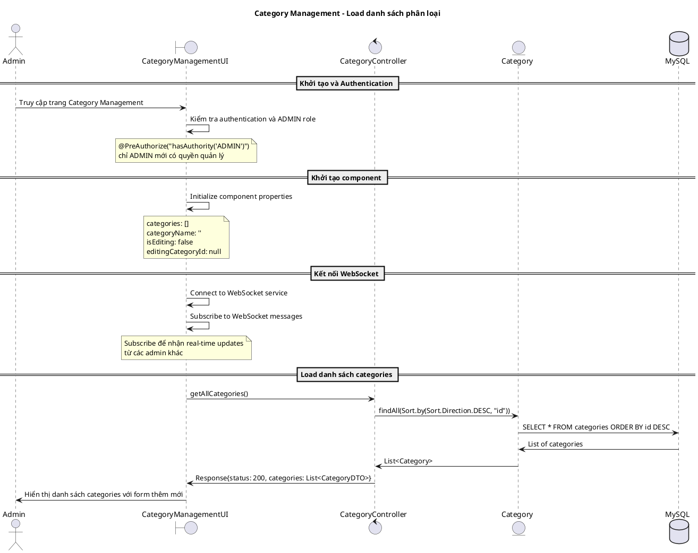
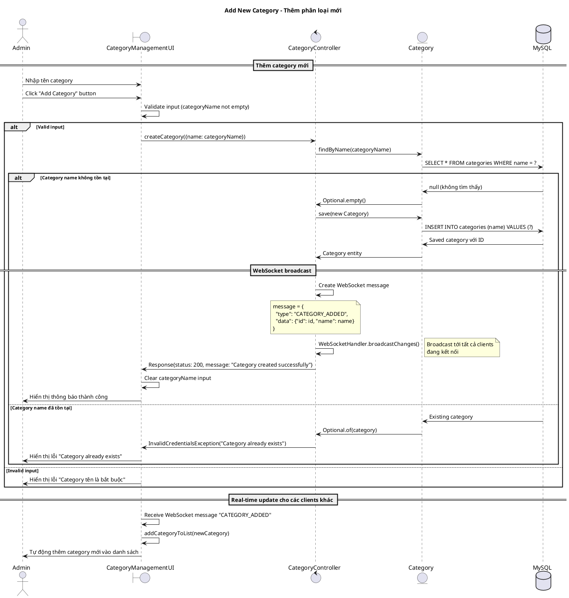
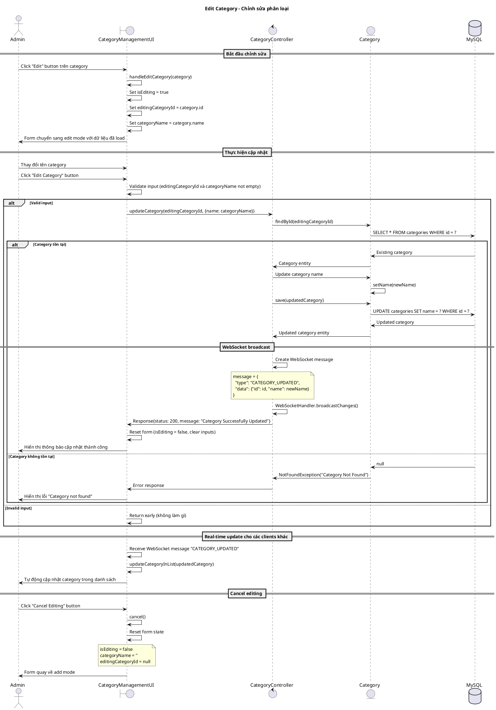
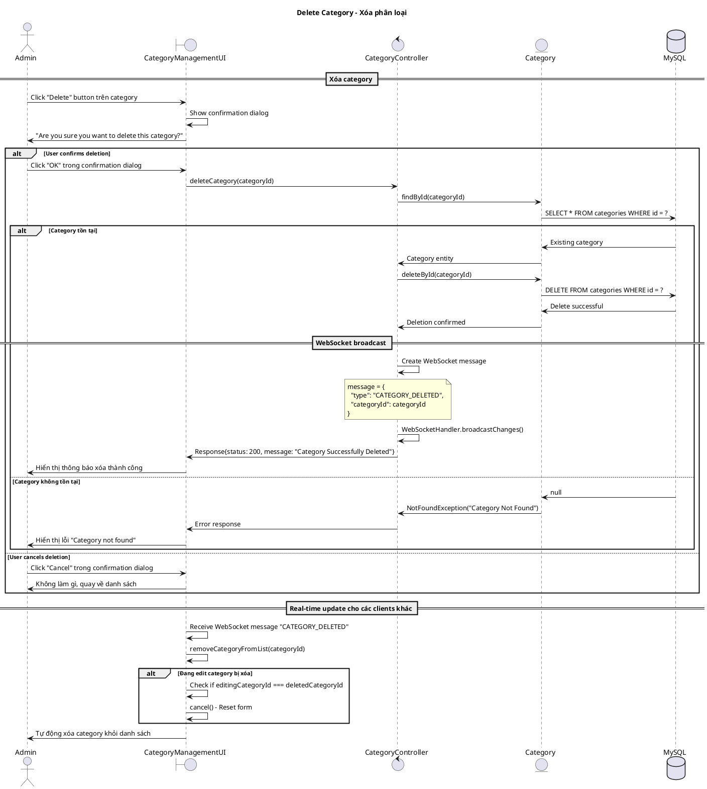
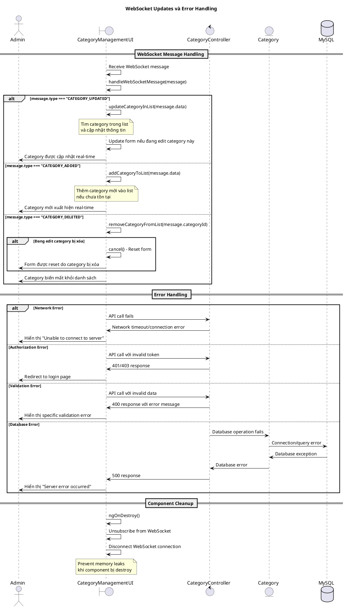

# Biểu đồ trình tự - Use case: Quản lý phân loại (Category Management)

## Mô tả
Use case này cho phép Admin quản lý các phân loại sản phẩm trong hệ thống, bao gồm: xem danh sách, thêm mới, chỉnh sửa và xóa phân loại. Hệ thống cũng hỗ trợ cập nhật real-time thông qua WebSocket.

## 1. Sequence Diagram - Khởi tạo và Load danh sách phân loại



## 2. Sequence Diagram - Thêm phân loại mới



## 3. Sequence Diagram - Chỉnh sửa phân loại



## 4. Sequence Diagram - Xóa phân loại



## 5. Sequence Diagram - WebSocket Real-time Updates và Error Handling



## Các trường hợp đặc biệt

### 1. Authorization và Security
```typescript
// Chỉ ADMIN mới có quyền thao tác
@PreAuthorize("hasAuthority('ADMIN')")
public ResponseEntity<Response> createCategory(@RequestBody @Valid CategoryDTO categoryDTO)

// Frontend kiểm tra role trước khi hiển thị
if (!this.apiService.isAdmin()) {
    // Redirect hoặc hide functionality
}
```

### 2. WebSocket Message Types
```typescript
interface WebSocketMessage {
    type: 'CATEGORY_ADDED' | 'CATEGORY_UPDATED' | 'CATEGORY_DELETED';
    data?: {id: string, name: string};
    categoryId?: string; // Cho delete operation
}
```

### 3. Real-time Synchronization
- **CATEGORY_ADDED**: Thêm category mới vào danh sách tất cả clients
- **CATEGORY_UPDATED**: Cập nhật category trong danh sách và form nếu đang edit
- **CATEGORY_DELETED**: Xóa category khỏi danh sách và reset form nếu cần

### 4. Form State Management
```typescript
interface FormState {
    isEditing: boolean;           // Edit mode vs Add mode
    editingCategoryId: string;    // ID của category đang edit
    categoryName: string;         // Input value
}
```

### 5. Database Constraints
- **Unique Constraint**: Category name phải unique
- **Foreign Key**: Categories có thể được reference bởi Products
- **Soft Delete**: Có thể implement soft delete thay vì hard delete

### 6. Error Scenarios
- **Duplicate Name**: Tên category đã tồn tại
- **Category In Use**: Category đang được sử dụng bởi products
- **Concurrent Modification**: Hai admin cùng edit một category
- **Network Issues**: Mất kết nối trong quá trình thao tác

## Performance Considerations
- **Caching**: Cache category list để giảm database calls
- **Pagination**: Implement pagination nếu có nhiều categories
- **Debouncing**: Debounce WebSocket updates để tránh spam
- **Optimistic Updates**: Update UI trước, rollback nếu API fails

## Business Rules
1. **ADMIN Only**: Chỉ ADMIN mới có quyền CRUD categories
2. **Unique Names**: Tên category phải unique trong hệ thống  
3. **Required Field**: Tên category không được để trống
4. **Real-time Sync**: Tất cả changes được sync real-time
5. **Confirmation**: Xóa category cần confirmation
6. **Form Reset**: Form được reset sau successful operations