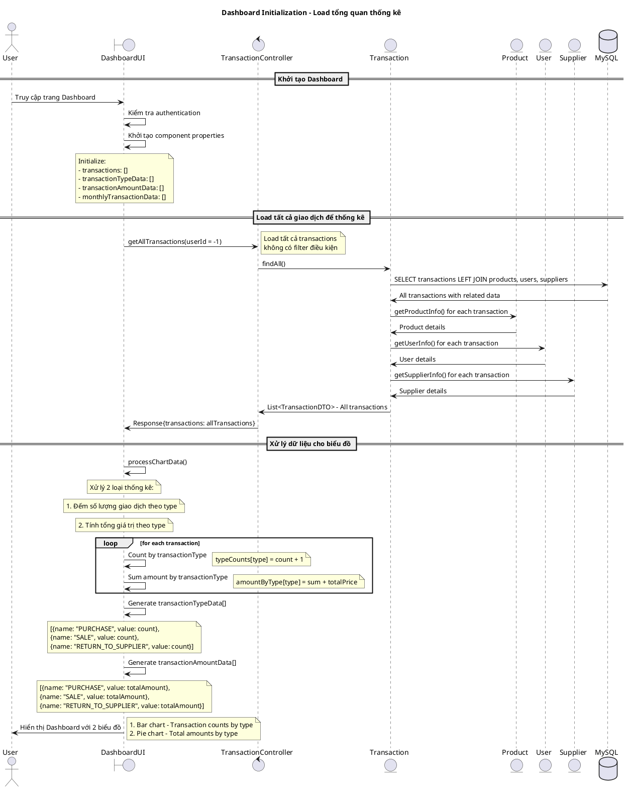
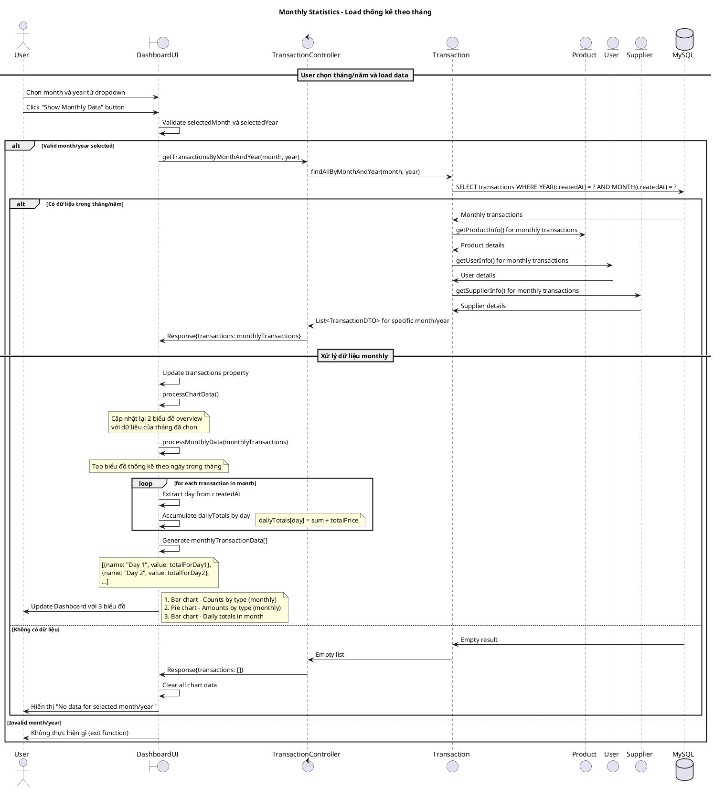
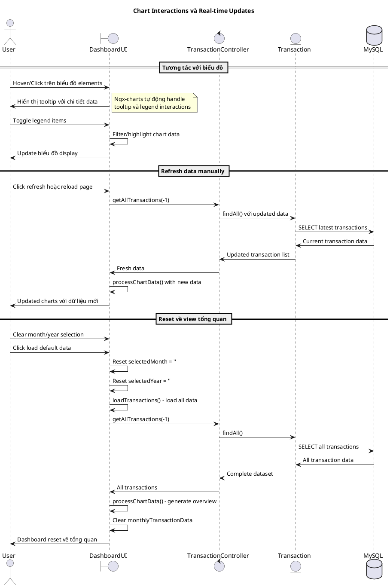
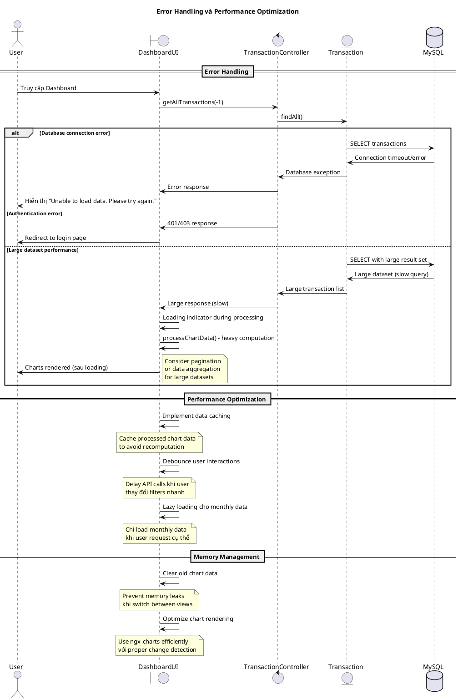

# Biểu đồ trình tự - Use case: Xem thống kê (Dashboard)

## Mô tả
Use case này cho phép người dùng xem các thống kê về giao dịch thông qua dashboard với các biểu đồ trực quan: số lượng giao dịch theo loại, tổng giá trị giao dịch theo loại, và thống kê giao dịch theo ngày trong tháng được chọn.

## 1. Sequence Diagram - Khởi tạo Dashboard và Load thống kê tổng quan



## 2. Sequence Diagram - Load thống kê theo tháng/năm cụ thể



## 3. Sequence Diagram - Tương tác với biểu đồ và cập nhật real-time



## 4. Sequence Diagram - Error Handling và Performance



## Các trường hợp đặc biệt

### 1. Data Processing Logic
```typescript
// Xử lý dữ liệu cho biểu đồ
processChartData(): void {
    const typeCounts: { [key: string]: number } = {};
    const amountByType: { [key: string]: number } = {};

    this.transactions.forEach((transaction) => {
        const type = transaction.transactionType;
        typeCounts[type] = (typeCounts[type] || 0) + 1;
        amountByType[type] = (amountByType[type] || 0) + transaction.totalPrice;
    });

    // Generate chart data arrays
    this.transactionTypeData = Object.keys(typeCounts).map((type) => ({
        name: type, value: typeCounts[type]
    }));
    
    this.transactionAmountData = Object.keys(amountByType).map((type) => ({
        name: type, value: amountByType[type]
    }));
}
```

### 2. Monthly Data Processing
```typescript
// Xử lý dữ liệu theo ngày trong tháng
processMonthlyData(transactions: any[]): void {
    const dailyTotals: { [key: string]: number } = {};

    transactions.forEach((transaction) => {
        const day = new Date(transaction.createdAt).getDate().toString();
        dailyTotals[day] = (dailyTotals[day] || 0) + transaction.totalPrice;
    });

    this.monthlyTransactionData = Object.keys(dailyTotals).map((day) => ({
        name: `Day ${day}`, value: dailyTotals[day]
    }));
}
```

### 3. Chart Configuration
- **Bar Charts**: Vertical bars với labels trên trục X và Y
- **Pie Chart**: Doughnut style với legends và labels
- **Responsive Design**: Charts adapt theo screen size
- **Animations**: Smooth transitions khi data changes

### 4. Performance Considerations
- **Data Caching**: Cache chart data để tránh recomputation
- **Lazy Loading**: Chỉ load monthly data khi cần thiết
- **Debouncing**: Delay API calls khi user thay đổi selections
- **Memory Management**: Clear old data để tránh memory leaks

### 5. Error States
- **No Data**: Hiển thị empty state với helpful message
- **Loading States**: Show loading indicators during API calls
- **Network Errors**: Retry mechanisms và error notifications
- **Authentication Errors**: Redirect to login

## Tích hợp với hệ thống
- **Role-based Access**: Dashboard có thể hiển thị data khác nhau theo role
- **Real-time Updates**: Có thể tích hợp WebSocket để update charts real-time
- **Export Functionality**: Có thể thêm export charts as images/PDF
- **Drill-down**: Click vào chart elements để xem chi tiết transactions