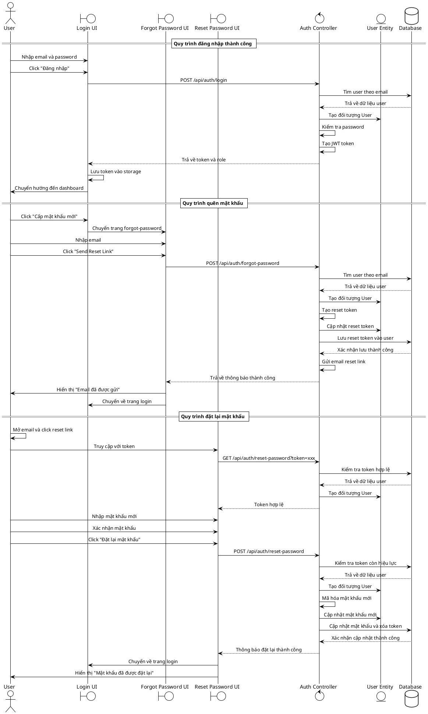

# Biểu đồ trình tự - Chức năng Đăng nhập và Quản lý Mật khẩu

## Mô tả quy trình

### 1. Đăng nhập thành công
- User nhập thông tin đăng nhập
- Hệ thống xác thực và tạo JWT token
- Chuyển hướng đến dashboard

### 2. Quên mật khẩu
- User yêu cầu reset mật khẩu
- Hệ thống tạo token và gửi email
- Hiển thị thông báo thành công

### 3. Đặt lại mật khẩu
- User truy cập link từ email
- Xác thực token và cập nhật mật khẩu mới
- Chuyển về trang đăng nhập