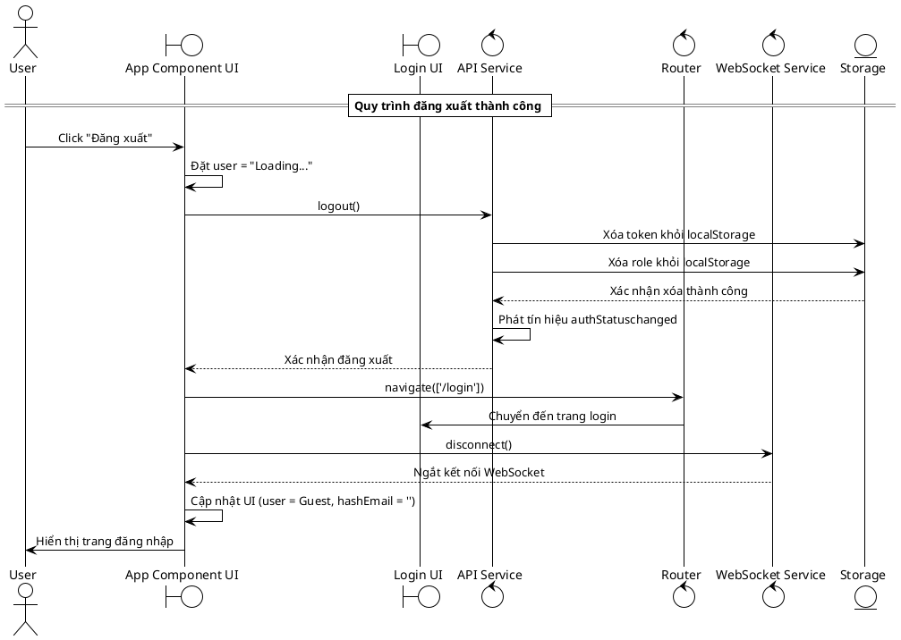

# Biểu đồ trình tự - Chức năng Đăng xuất

## Mô tả quy trình

### Quy trình đăng xuất
1. **User tương tác**: Click nút "Đăng xuất" trên giao diện
2. **Cập nhật UI**: Hiển thị trạng thái "Loading..." 
3. **Xóa dữ liệu**: Xóa token và role khỏi localStorage
4. **Phát tín hiệu**: Thông báo thay đổi trạng thái đăng nhập
5. **Chuyển hướng**: Điều hướng về trang đăng nhập
6. **Ngắt kết nối**: Đóng kết nối WebSocket
7. **Reset dữ liệu**: Đặt lại thông tin user về Guest
8. **Hoàn thành**: Hiển thị trang đăng nhập cho user