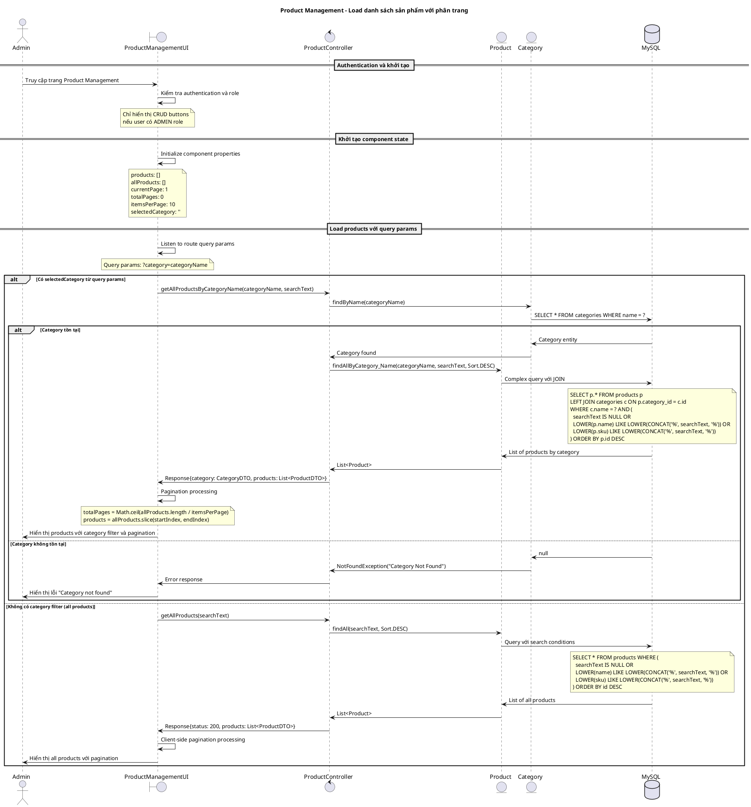
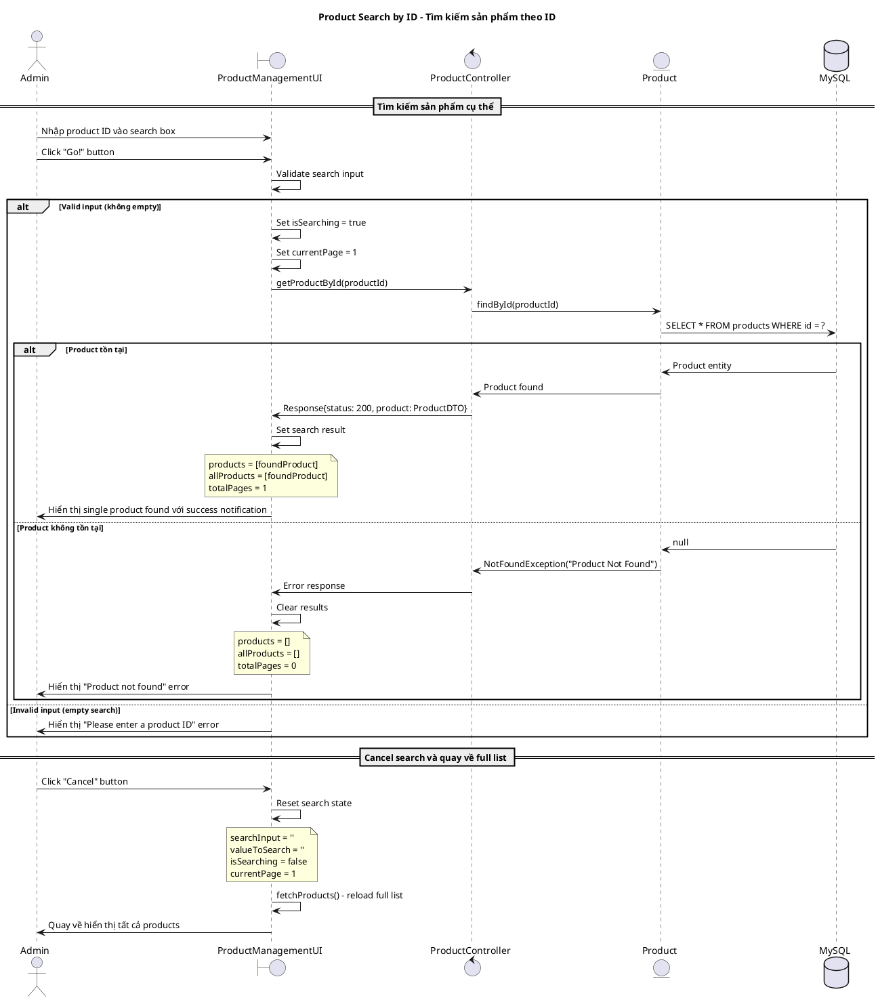
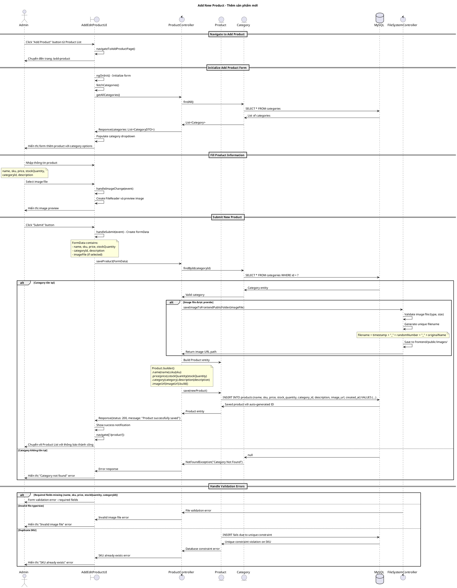
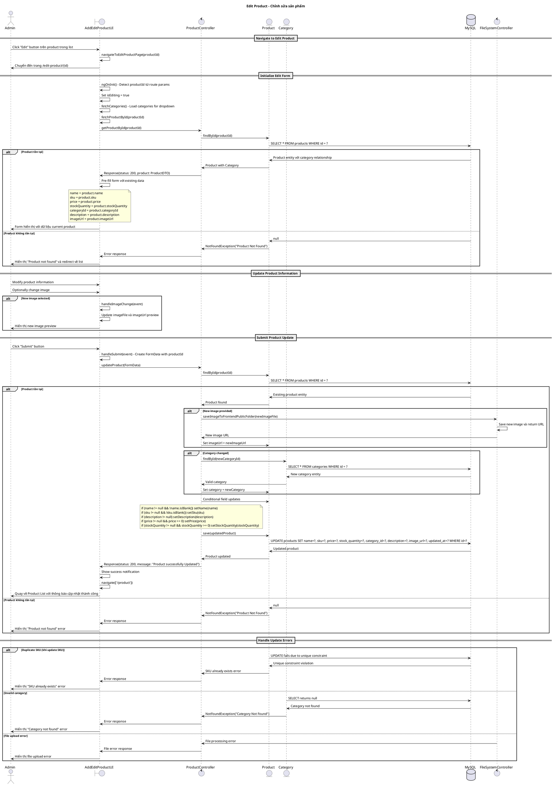
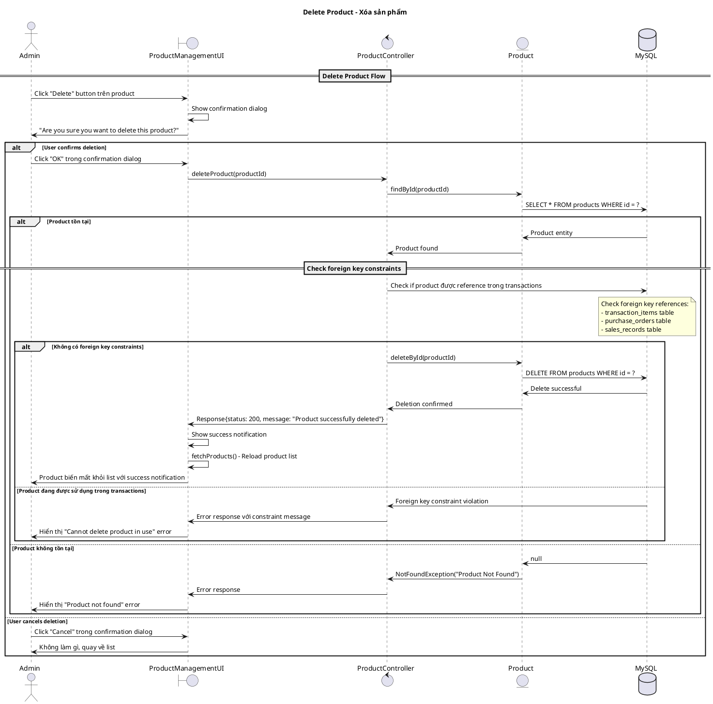
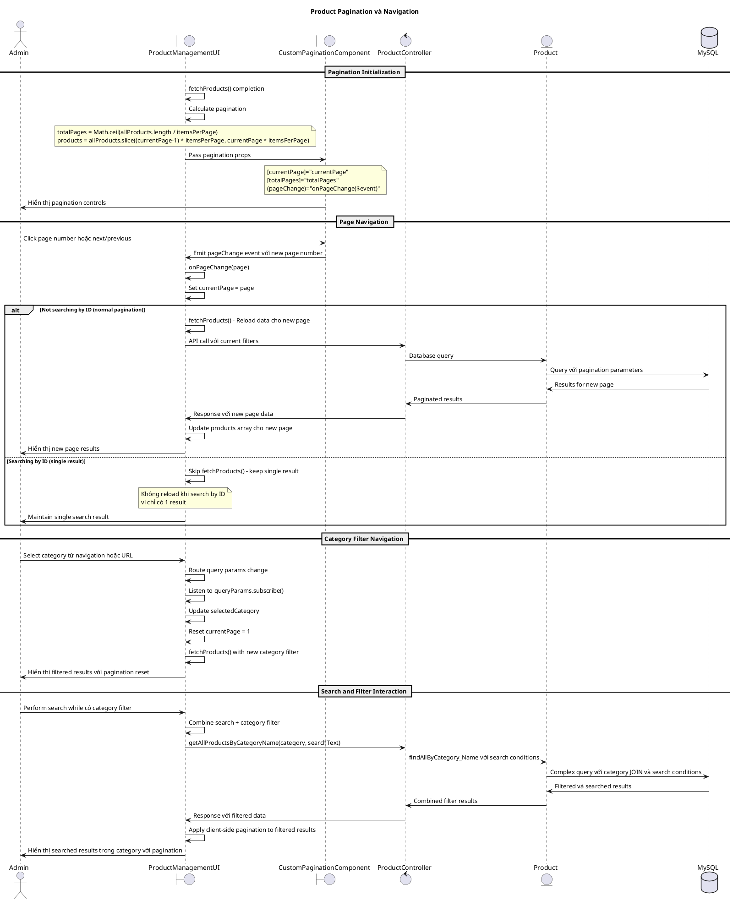
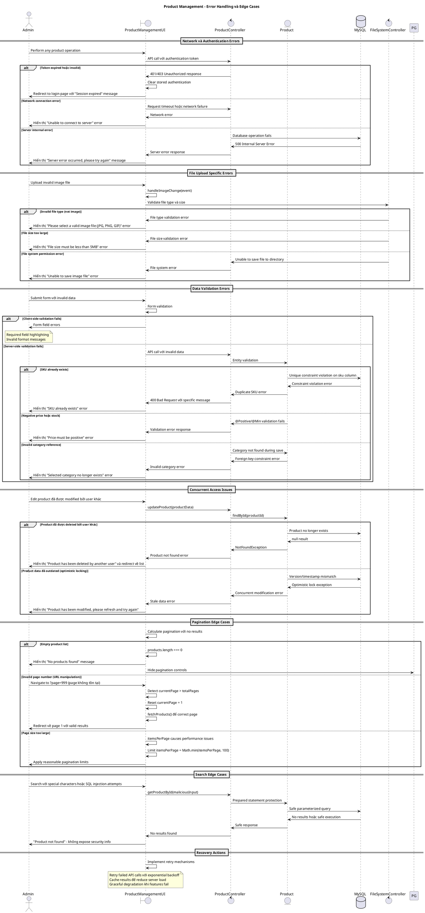

# Biểu đồ trình tự - Use case: Quản lý sản phẩm (Product Management)

## Mô tả
Use case này cho phép Admin quản lý các sản phẩm trong hệ thống, bao gồm: xem danh sách, tìm kiếm, phân trang, thêm mới, chỉnh sửa và xóa sản phẩm. Hệ thống hỗ trợ tìm kiếm theo ID cụ thể, lọc theo category, upload hình ảnh và pagination để xử lý large datasets.

## 1. Sequence Diagram - Khởi tạo và Load danh sách sản phẩm



## 2. Sequence Diagram - Tìm kiếm sản phẩm theo ID



## 3. Sequence Diagram - Thêm sản phẩm mới



## 4. Sequence Diagram - Chỉnh sửa sản phẩm



## 5. Sequence Diagram - Xóa sản phẩm



## 6. Sequence Diagram - Pagination và Navigation



## 7. Sequence Diagram - Error Handling và Edge Cases



## Đặc điểm nổi bật của Product Management System

### 1. **Complex Search và Filtering**
```typescript
interface ProductSearchParams {
    searchText?: string;        // Search by name, SKU, stock quantity
    categoryName?: string;      // Filter by category
    page?: number;             // Pagination
    size?: number;             // Page size
}
```

### 2. **File Upload Management**
```java
// Backend file handling
private static final String IMAGE_DIRECTORY = System.getProperty("user.dir") + "/product-image/";
private static final String IMAGE_DIRECTOR_FRONTEND = "D:\\GitHub\\InventoryManagement\\frontend\\public\\images\\";

// Unique filename generation
String filename = System.currentTimeMillis() + "_" + 
                 (int)(Math.random() * 10000) + "_" + 
                 originalFilename.replaceAll("\\s+", "_").toLowerCase();
```

### 3. **Advanced Pagination**
```typescript
// Client-side pagination logic
totalPages = Math.ceil(allProducts.length / itemsPerPage);
products = allProducts.slice(
    (currentPage - 1) * itemsPerPage,
    currentPage * itemsPerPage
);
```

### 4. **Database Query Complexity**
```sql
-- Search query với JOIN và multiple conditions
SELECT p.* FROM products p
LEFT JOIN categories c ON p.category_id = c.id
WHERE c.name = ? AND (
    ? IS NULL OR
    LOWER(p.name) LIKE LOWER(CONCAT('%', ?, '%')) OR
    LOWER(p.sku) LIKE LOWER(CONCAT('%', ?, '%')) OR
    CAST(p.stock_quantity AS string) = ?
) ORDER BY p.id DESC
```

### 5. **Form State Management**
```typescript
interface ProductForm {
    isEditing: boolean;
    productId: string | null;
    name: string;
    sku: string;               // Unique constraint
    price: string;             // Must be positive
    stockQuantity: string;     // Must be >= 0
    categoryId: string;        // Foreign key
    description?: string;
    imageFile?: File;
    imageUrl?: string;
}
```

### 6. **Role-based Access Control**
```html
<!-- Admin-only buttons -->
<button *ngIf="isAdmin()" class="btn btn-app" (click)="navigateToAddProductPage()">
<td *ngIf="isAdmin()"><button (click)="navigateToEditProductPage(product.id)">Edit</button></td>
<td *ngIf="isAdmin()"><button (click)="handleProductDelete(product.id)">Delete</button></td>
```

### 7. **Navigation Patterns**
- **List View**: `/product` - với optional `?category=categoryName`
- **Add View**: `/add-product` - Form thêm mới
- **Edit View**: `/edit-product/{id}` - Form edit với pre-filled data
- **Search Mode**: Same page với filtered results

### 8. **Data Validation Layers**
```java
// Entity validation
@NotBlank(message = "Name is required")
private String name;

@NotBlank(message = "Sku is required")
@Column(unique = true)
private String sku;

@Positive(message = "Product price must be a positive value")
private BigDecimal price;

@Min(value = 0, message = "Stock quantity cannot be lesser than zero")
private Integer stockQuantity;
```

### 9. **Error Handling Strategies**
- **Network Errors**: Retry mechanisms với exponential backoff
- **Validation Errors**: Client + server-side validation
- **File Upload Errors**: Type, size, permission checking
- **Concurrent Access**: Optimistic locking protection
- **Foreign Key Violations**: Graceful constraint error handling

### 10. **Performance Optimizations**
- **Client-side Pagination**: Reduce server load
- **Image Optimization**: File size limits và compression
- **Search Debouncing**: Prevent excessive API calls
- **Lazy Loading**: Load categories only when needed
- **Caching**: Store frequent queries results

### 11. **Business Rules**
1. **ADMIN Authorization**: Chỉ ADMIN mới có quyền CRUD
2. **SKU Uniqueness**: Mỗi product phải có SKU unique
3. **Category Dependency**: Product phải thuộc về 1 category hợp lệ
4. **Stock Management**: Stock quantity không được âm
5. **Price Validation**: Price phải positive
6. **Image Management**: Support multiple image formats với size limits
7. **Search Flexibility**: Search by name, SKU, hoặc exact stock quantity
8. **Pagination**: Handle large datasets efficiently
9. **Confirmation**: Delete operations cần user confirmation
10. **Foreign Key Protection**: Không thể delete product đang được sử dụng

Hệ thống Product Management này rất comprehensive với full CRUD operations, advanced search, file upload, pagination, và robust error handling phù hợp cho enterprise-level inventory management system.