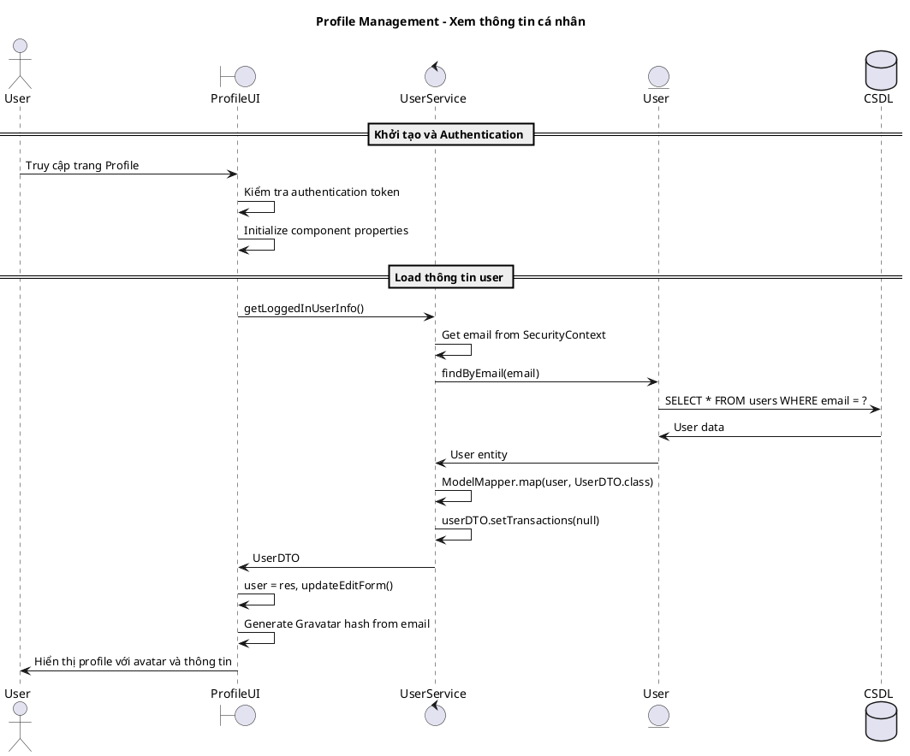
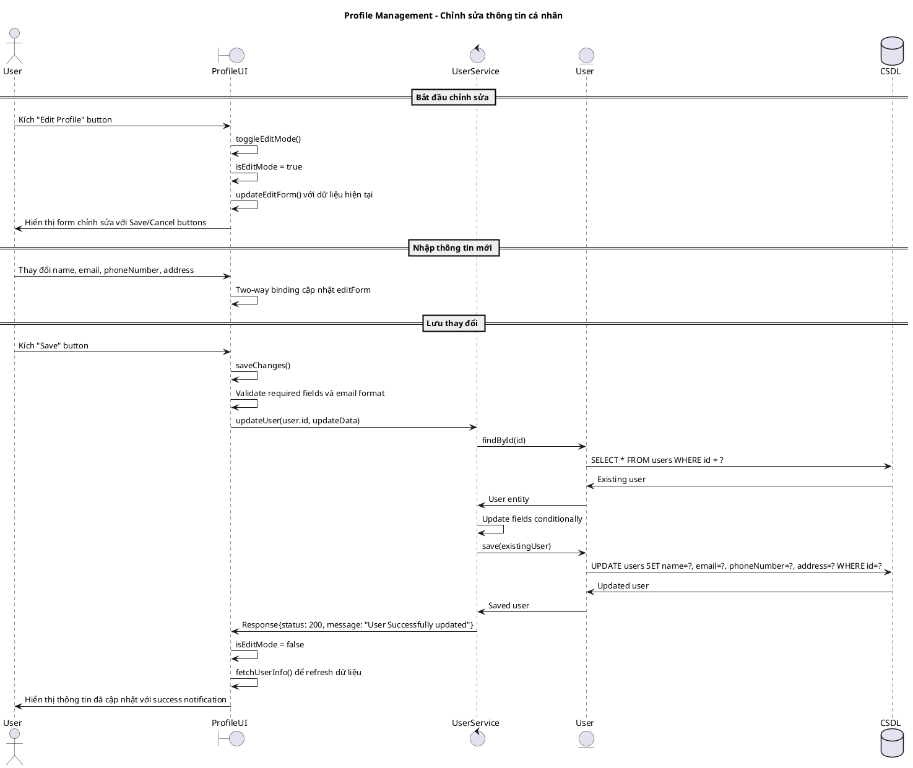
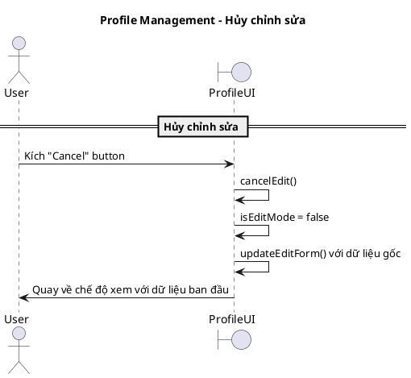
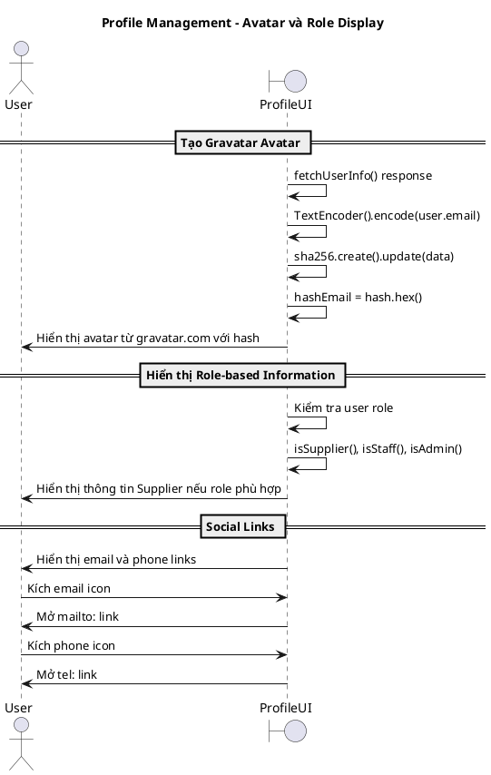
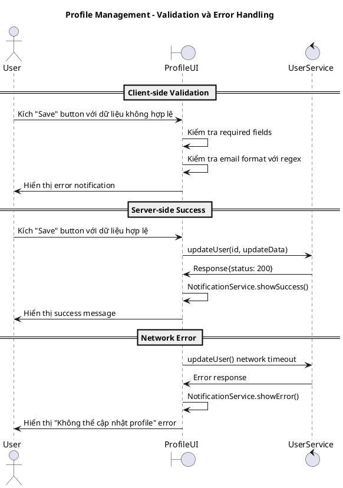

# Biểu đồ trình tự - Use case: Quản lý thông tin cá nhân (Profile Management)

## Mô tả
Use case này cho phép người dùng xem và chỉnh sửa thông tin cá nhân của mình, bao gồm: hiển thị profile, chỉnh sửa thông tin và cập nhật dữ liệu. Hệ thống hỗ trợ Gravatar avatar và validation dữ liệu.

## 1. Sequence Diagram - Xem thông tin cá nhân

## 2. Sequence Diagram - Chỉnh sửa thông tin cá nhân

## 3. Sequence Diagram - Hủy chỉnh sửa

## 4. Sequence Diagram - Khởi tạo Avatar và Role Display

## 5. Sequence Diagram - Validation và Error Handling

## Đặc điểm chính của hệ thống

### 1. Security và Authentication
- JWT token validation tự động
- Chỉ user đăng nhập mới xem được profile
- Không thể chỉnh sửa role của chính mình

### 2. User Experience
- Edit mode toggle với Save/Cancel options
- Real-time form validation
- Gravatar integration cho avatar
- Role-based information display

### 3. Data Management
- Two-way data binding
- Form state management
- Original data preservation cho cancel functionality
- Conditional field updates

### 4. Integration Features
- Email và phone clickable links
- Supplier information display cho appropriate roles
- Responsive design với Bootstrap classes
- Icon-based action buttons

### 5. Performance Optimization
- Client-side validation trước server call
- Form data caching
- Selective field updates
- Efficient re-rendering