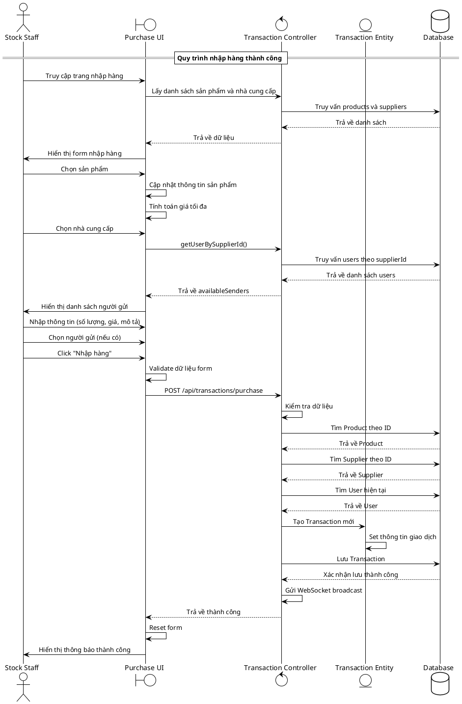

# Biểu đồ trình tự - Chức năng Nhập hàng (Stock Staff)

## Mô tả quy trình

### Quy trình nhập hàng của Stock Staff
1. **Khởi tạo**: Truy cập trang nhập hàng và lấy danh sách sản phẩm/nhà cung cấp
2. **Chọn sản phẩm**: Hiển thị thông tin chi tiết và tính giá tối đa
3. **Chọn nhà cung cấp**: Lấy danh sách người gửi thuộc nhà cung cấp đó
4. **Nhập thông tin**: Số lượng, giá nhập, mô tả và người gửi
5. **Xử lý giao dịch**: Validate, tạo Transaction entity và lưu vào database
6. **Thông báo**: Gửi WebSocket broadcast và hiển thị kết quả
7. **Hoàn thành**: Reset form và sẵn sàng cho giao dịch tiếp theo