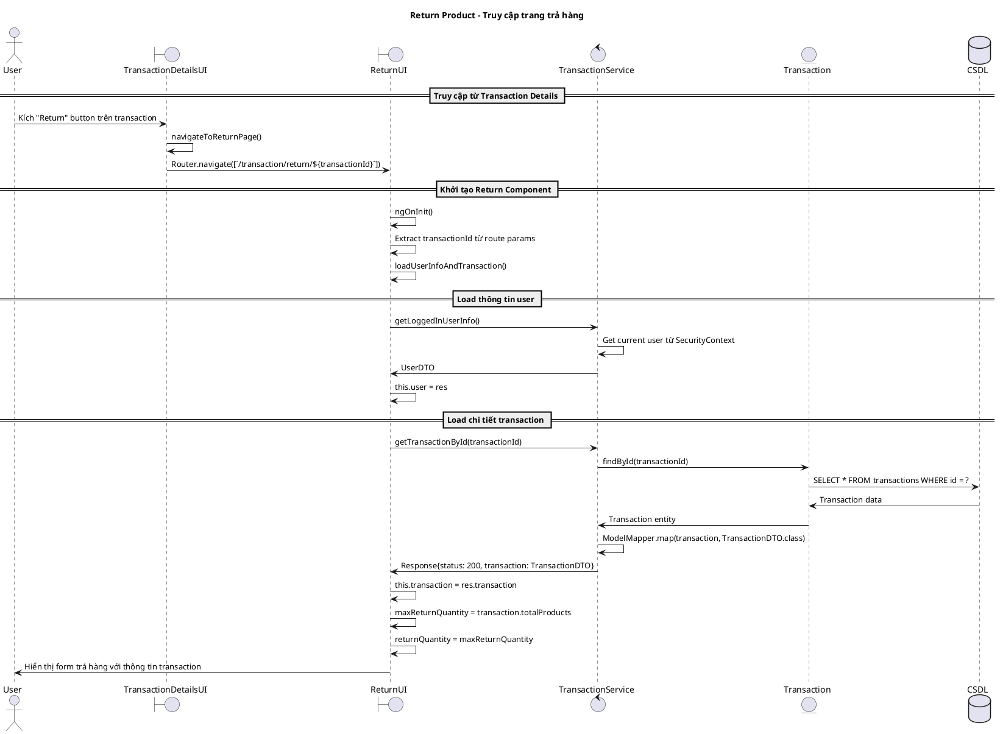
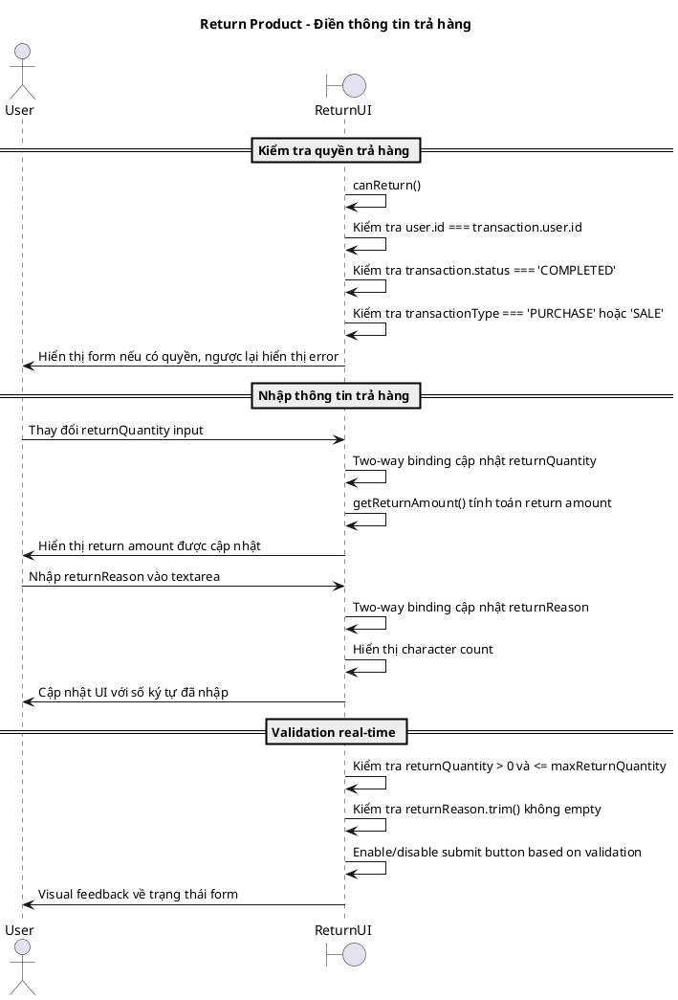
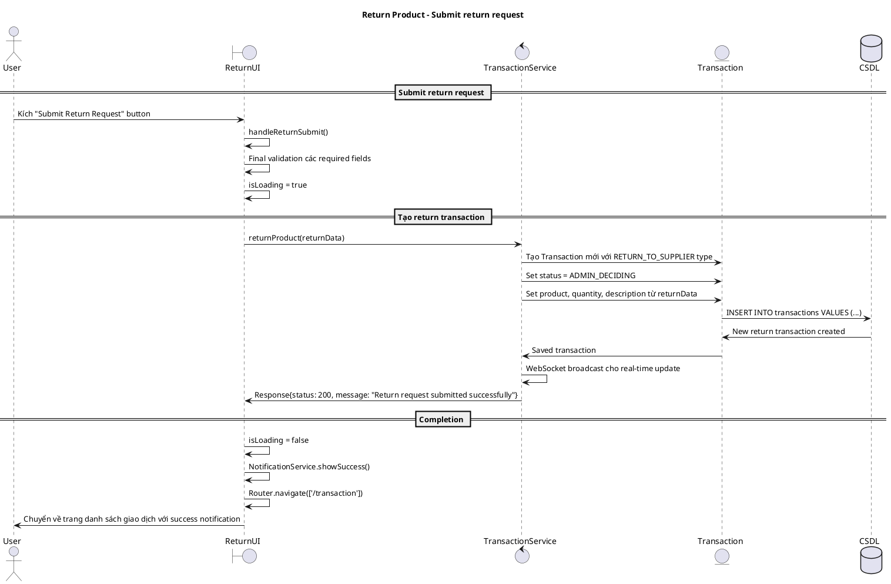
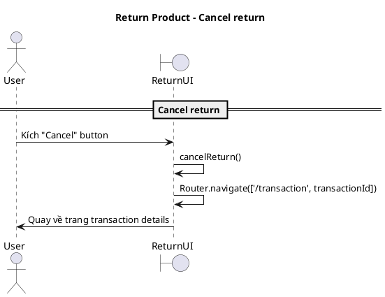
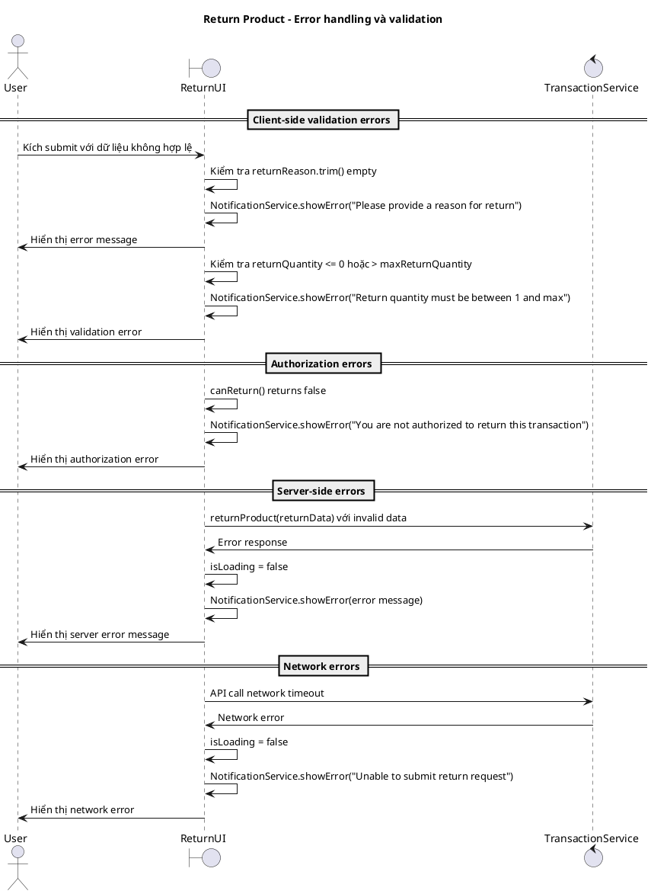
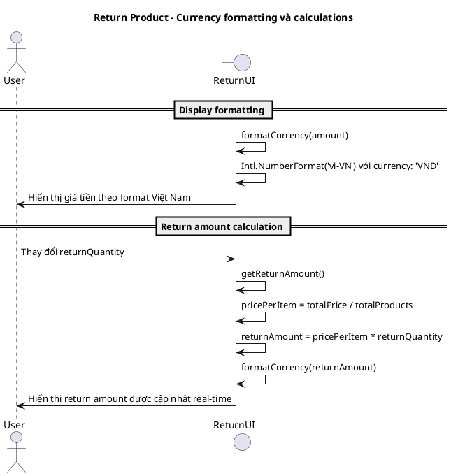

# Biểu đồ trình tự - Use case: Trả hàng (Return Product)

## Mô tả
Use case này cho phép người dùng thực hiện trả hàng từ một giao dịch đã hoàn thành, bao gồm: truy cập trang trả hàng, điền thông tin lý do và số lượng, submit request và quay về danh sách giao dịch.

## 1. Sequence Diagram - Truy cập trang trả hàng

## 2. Sequence Diagram - Điền thông tin trả hàng

## 3. Sequence Diagram - Submit return request

## 4. Sequence Diagram - Cancel return

## 5. Sequence Diagram - Error handling và validation

## 6. Sequence Diagram - Currency formatting và calculations

## Đặc điểm chính của hệ thống

### 1. Authorization và Security
- Chỉ người mua hoặc ADMIN mới có thể trả hàng
- Chỉ giao dịch COMPLETED mới được trả
- Chỉ PURCHASE và SALE transactions có thể return

### 2. User Experience
- Real-time validation và feedback
- Currency formatting theo chuẩn Việt Nam
- Character counter cho textarea
- Loading states during API calls
- Auto-calculate return amount

### 3. Data Validation
- Required field validation (reason, quantity)
- Quantity range validation (1 to maxReturnQuantity)
- Maximum character limit cho reason (1000 chars)
- Authorization checks

### 4. Business Logic
- Default return quantity = full quantity
- Return amount calculation based on unit price
- Create new RETURN_TO_SUPPLIER transaction
- Set initial status = ADMIN_DECIDING

### 5. Integration Features
- Router navigation với transaction ID
- WebSocket real-time updates
- Notification service cho user feedback
- Form state management với two-way binding

### 6. Error Handling
- Client-side validation trước server call
- Server error handling với user-friendly messages
- Network error handling
- Authorization error handling
- Loading state management