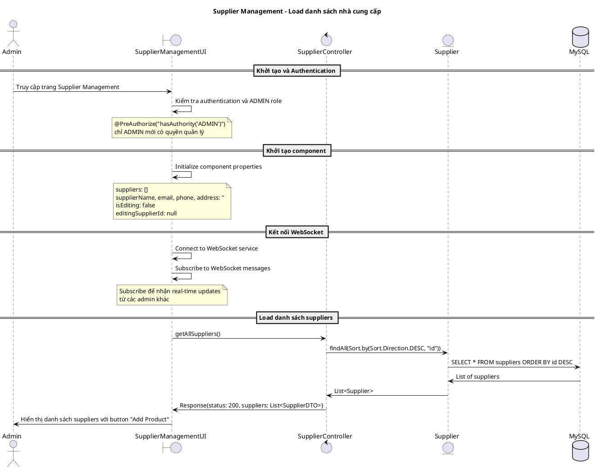
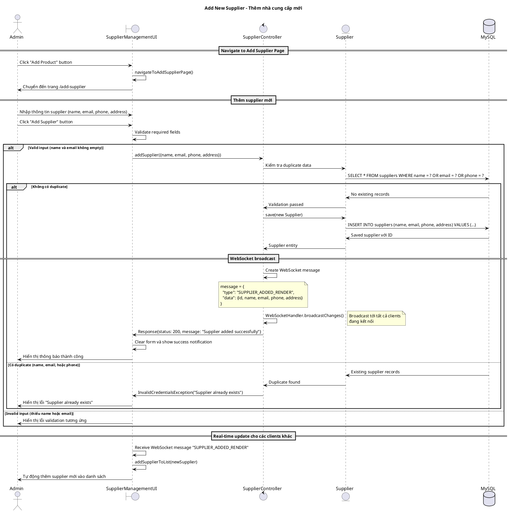
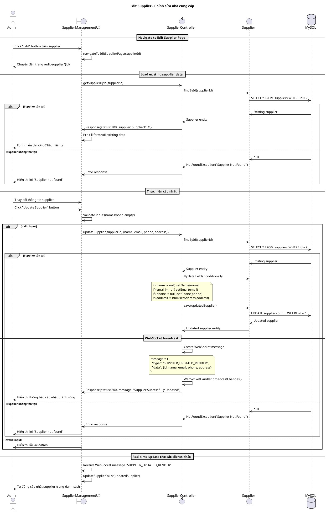
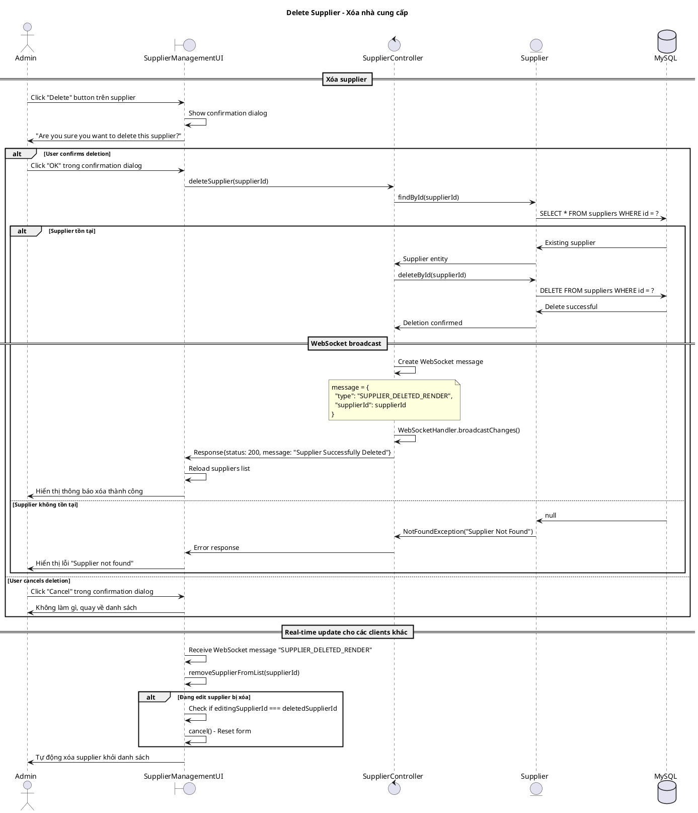
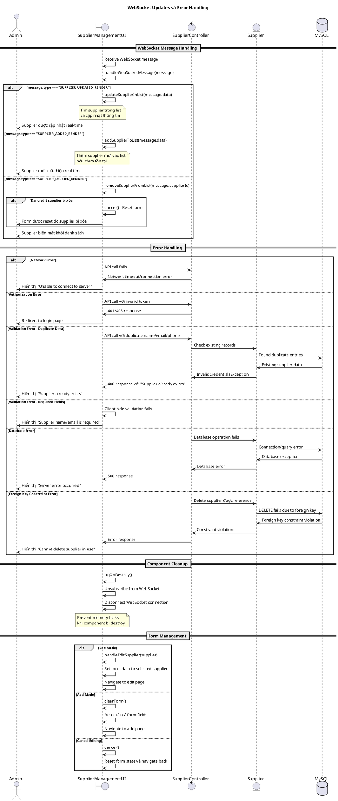

# Biểu đồ trình tự - Use case: Quản lý nhà cung cấp (Supplier Management)

## Mô tả
Use case này cho phép Admin quản lý các nhà cung cấp trong hệ thống, bao gồm: xem danh sách, thêm mới, chỉnh sửa và xóa nhà cung cấp. Hệ thống cũng hỗ trợ cập nhật real-time thông qua WebSocket và validation các trường dữ liệu unique (name, email, phone).

## 1. Sequence Diagram - Khởi tạo và Load danh sách nhà cung cấp



## 2. Sequence Diagram - Thêm nhà cung cấp mới



## 3. Sequence Diagram - Chỉnh sửa nhà cung cấp



## 4. Sequence Diagram - Xóa nhà cung cấp



## 5. Sequence Diagram - WebSocket Real-time Updates và Error Handling



## Các trường hợp đặc biệt

### 1. Authorization và Security
```typescript
// Chỉ ADMIN mới có quyền thao tác
@PreAuthorize("hasAuthority('ADMIN')")
public ResponseEntity<Response> addSupplier(@RequestBody @Valid SupplierDTO supplierDTO)

// Frontend kiểm tra role trước khi hiển thị
if (!this.apiService.isAdmin()) {
    // Hide CRUD functionality
}
```

### 2. Unique Constraints Validation
```java
// Backend validation cho 3 trường unique
Optional<Supplier> supplier1 = supplierRepository.findByName(supplierDTO.getName());
Optional<Supplier> supplier2 = supplierRepository.findByPhone(supplierDTO.getPhone());
Optional<Supplier> supplier3 = supplierRepository.findByEmail(supplierDTO.getEmail());

if (supplier1.isPresent() || supplier2.isPresent() || supplier3.isPresent()) {
    throw new InvalidCredentialsException("Supplier already exists");
}
```

### 3. WebSocket Message Types
```typescript
interface SupplierWebSocketMessage {
    type: 'SUPPLIER_ADDED_RENDER' | 'SUPPLIER_UPDATED_RENDER' | 'SUPPLIER_DELETED_RENDER';
    data?: {
        id: string;
        name: string;
        email: string;
        phone: string;
        address: string;
    };
    supplierId?: string; // Cho delete operation
}
```

### 4. Form Data Structure
```typescript
interface SupplierForm {
    supplierName: string;     // Required
    supplierEmail: string;    // Required, unique
    supplierPhone: string;    // Optional, unique if provided
    supplierAddress: string;  // Optional
    isEditing: boolean;
    editingSupplierId: string | null;
}
```

### 5. Navigation Flow
- **List View**: `/supplier` - Hiển thị tất cả suppliers với Edit/Delete buttons
- **Add View**: `/add-supplier` - Form thêm supplier mới
- **Edit View**: `/edit-supplier/{id}` - Form edit với data pre-filled

### 6. Database Schema
```sql
CREATE TABLE suppliers (
    id BIGINT PRIMARY KEY AUTO_INCREMENT,
    name VARCHAR(255) NOT NULL UNIQUE,
    email VARCHAR(255) UNIQUE,
    phone VARCHAR(255) UNIQUE,
    address TEXT
);
```

### 7. Real-time Synchronization Features
- **Multi-admin Support**: Nhiều admin có thể quản lý suppliers cùng lúc
- **Conflict Resolution**: WebSocket updates giúp sync changes real-time
- **Form State Management**: Reset form nếu supplier đang edit bị xóa bởi admin khác

### 8. Error Scenarios Specific to Suppliers
- **Duplicate Name**: Tên supplier đã tồn tại
- **Duplicate Email**: Email đã được sử dụng
- **Duplicate Phone**: Số điện thoại đã tồn tại
- **Supplier In Use**: Supplier đang được reference bởi transactions/products
- **Required Fields**: Name và email bắt buộc phải có

## Performance Considerations
- **Pagination**: Implement nếu có nhiều suppliers
- **Search/Filter**: Thêm search functionality cho large datasets
- **Lazy Loading**: Load supplier details khi cần thiết
- **Optimistic Updates**: Update UI ngay, rollback nếu API fails

## Business Rules
1. **ADMIN Only**: Chỉ ADMIN mới có quyền CRUD suppliers
2. **Unique Constraints**: Name, email, phone phải unique
3. **Required Fields**: Name và email không được để trống
4. **Real-time Sync**: Tất cả changes được sync real-time
5. **Confirmation**: Xóa supplier cần confirmation
6. **Navigation**: Separate pages cho Add/Edit operations
7. **Form Reset**: Form được reset sau successful operations
8. **Foreign Key Protection**: Không thể xóa supplier đang được sử dụng