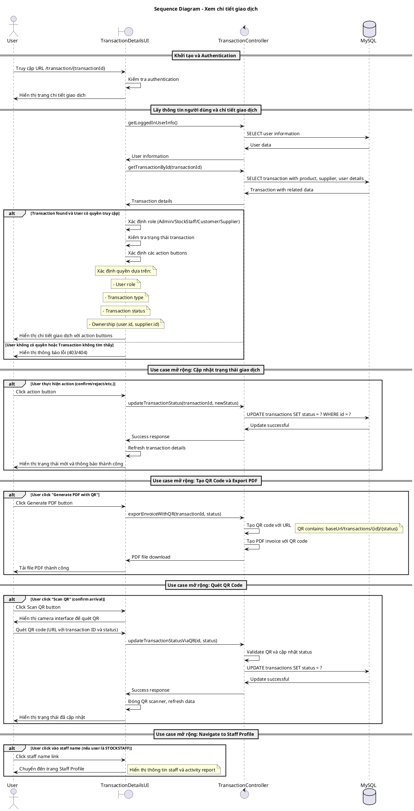

# Biểu đồ trình tự - Use case: Xem chi tiết giao dịch

## Mô tả
Use case này cho phép người dùng xem thông tin chi tiết của một giao dịch cụ thể, bao gồm thông tin sản phẩm, nhà cung cấp, người dùng, và các hành động có thể thực hiện tùy theo quyền và trạng thái giao dịch.

## Sequence Diagram - PlantUML



## Các trường hợp đặc biệt

### 1. Quyền truy cập dựa trên Role và Ownership
- **ADMIN**: Có thể xem tất cả giao dịch
- **STOCKSTAFF**: Chỉ xem giao dịch mà họ tạo hoặc liên quan
- **CUSTOMER**: Chỉ xem giao dịch của chính họ
- **SUPPLIER**: Chỉ xem giao dịch liên quan đến supplier của họ

### 2. Action Buttons hiển thị theo điều kiện
```typescript
// Logic xác định action buttons
canGenQR = transaction.type != "RETURN_TO_SUPPLIER" && 
           transaction.supplier.id == user.supplier.id && 
           transaction.status == 'PENDING'

canScanQR = (!isCustomer && transaction.supplier.id == user.supplier.id && 
            transaction.status == "PENDING") ||
            (isCustomer && transaction.type == "SALE" && 
            transaction.user.id == user.id && transaction.status == "PENDING")

canReturn = (isAdmin || (isStockstaff && user.id == transaction.user.id)) && 
            transaction.type == "PURCHASE" && transaction.status == "COMPLETED"
```

### 3. Real-time Updates
- Khi trạng thái giao dịch được cập nhật, UI tự động refresh để hiển thị trạng thái mới
- Không cần WebSocket, sử dụng refresh mechanism đơn giản

### 4. QR Code Workflow
- QR Code chứa URL: `{baseUrl}/transactions/{transactionId}/{newStatus}`
- Khi quét QR, hệ thống tự động cập nhật trạng thái giao dịch
- Dùng cho xác nhận nhận hàng, xác nhận thanh toán

### 5. Error Handling
- **404**: Transaction không tồn tại
- **403**: Không có quyền truy cập
- **400**: Dữ liệu không hợp lệ
- **500**: Lỗi server

## Tích hợp với các Use Case khác
- Liên kết với **Transaction Search** khi navigate từ danh sách
- Kết nối với **Staff Profile** khi click vào tên staff
- Liên kết với **Return Transaction** use case khi click return button

## Performance Considerations
- Lazy loading cho Product, Supplier, User relationships
- Caching transaction details để tránh query lặp lại
- PDF generation optimization