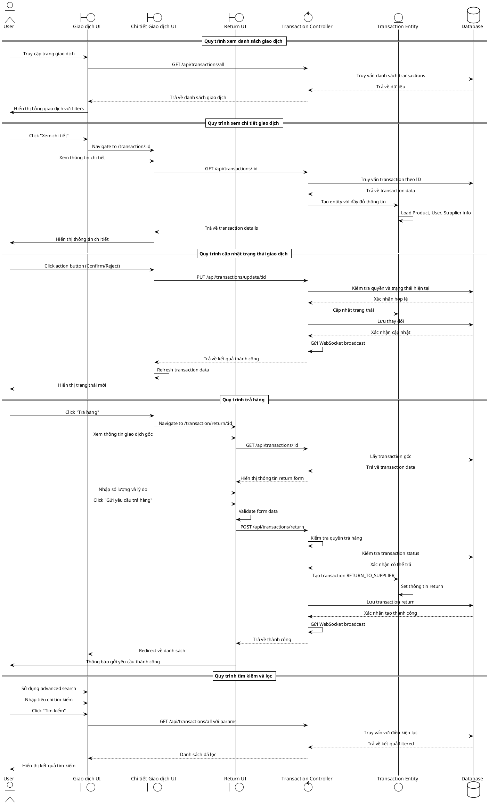

# Biểu đồ trình tự - Hệ thống Quản lý Giao dịch

## Mô tả quy trình

### 1. Xem danh sách giao dịch
- User truy cập trang giao dịch
- Hệ thống load và hiển thị danh sách với pagination
- Hỗ trợ tìm kiếm và lọc theo nhiều tiêu chí

### 2. Xem chi tiết giao dịch
- User click vào giao dịch để xem chi tiết
- Hệ thống load thông tin đầy đủ (Product, User, Supplier)
- Hiển thị các action buttons tùy theo role và trạng thái

### 3. Cập nhật trạng thái
- User thực hiện action (Confirm, Reject, etc.)
- Hệ thống validate quyền và cập nhật trạng thái
- Gửi WebSocket notification và refresh UI

### 4. Trả hàng
- User yêu cầu trả hàng từ chi tiết giao dịch
- Điền form với số lượng và lý do
- Hệ thống tạo transaction RETURN_TO_SUPPLIER mới
- Thông báo thành công và quay về danh sách

### 5. Tìm kiếm và lọc
- Hỗ trợ tìm kiếm theo ID, type, status, tên sản phẩm
- Lọc theo khoảng thời gian
- Real-time update với WebSocket integration