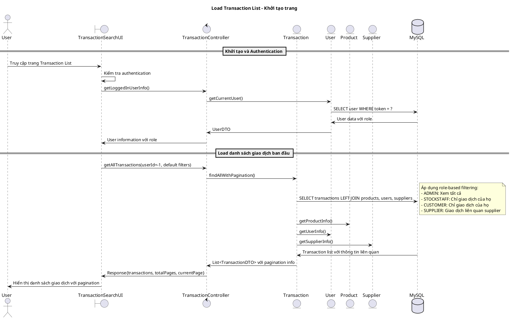
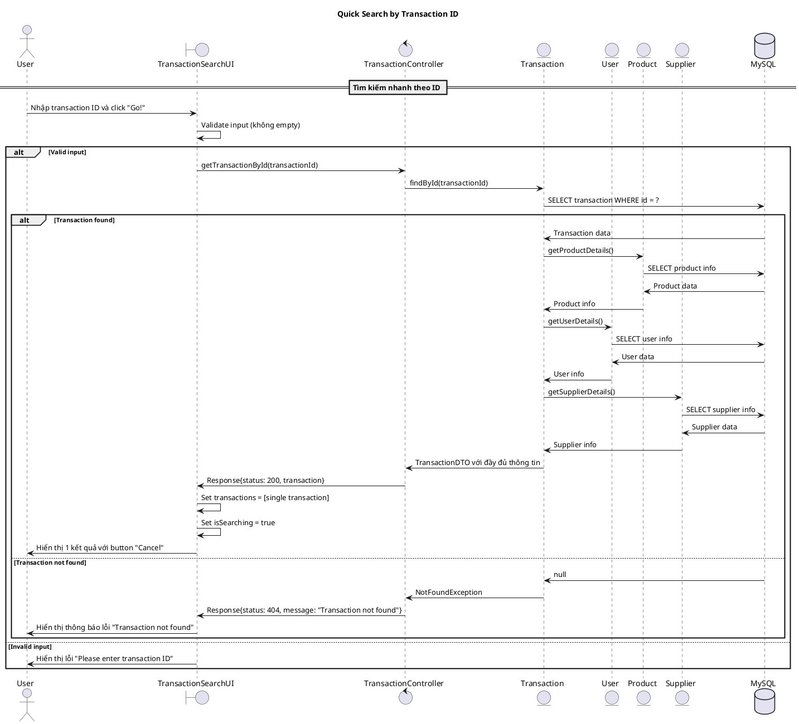
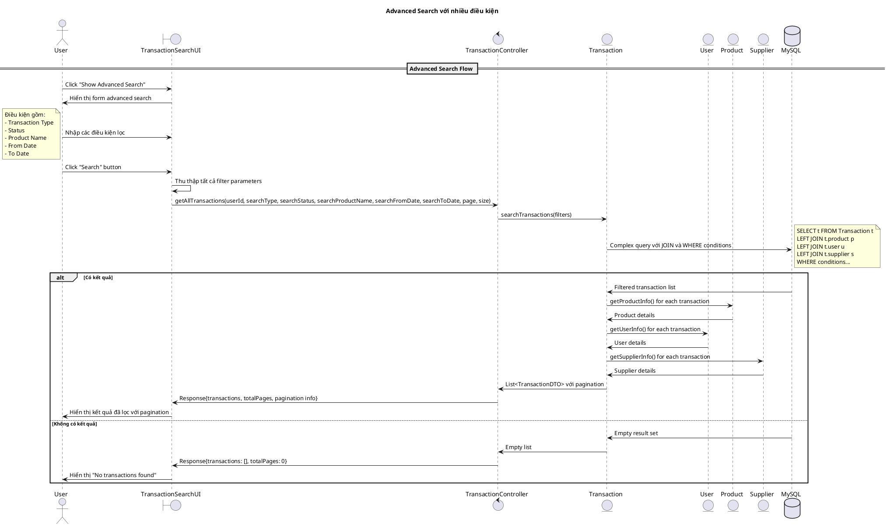
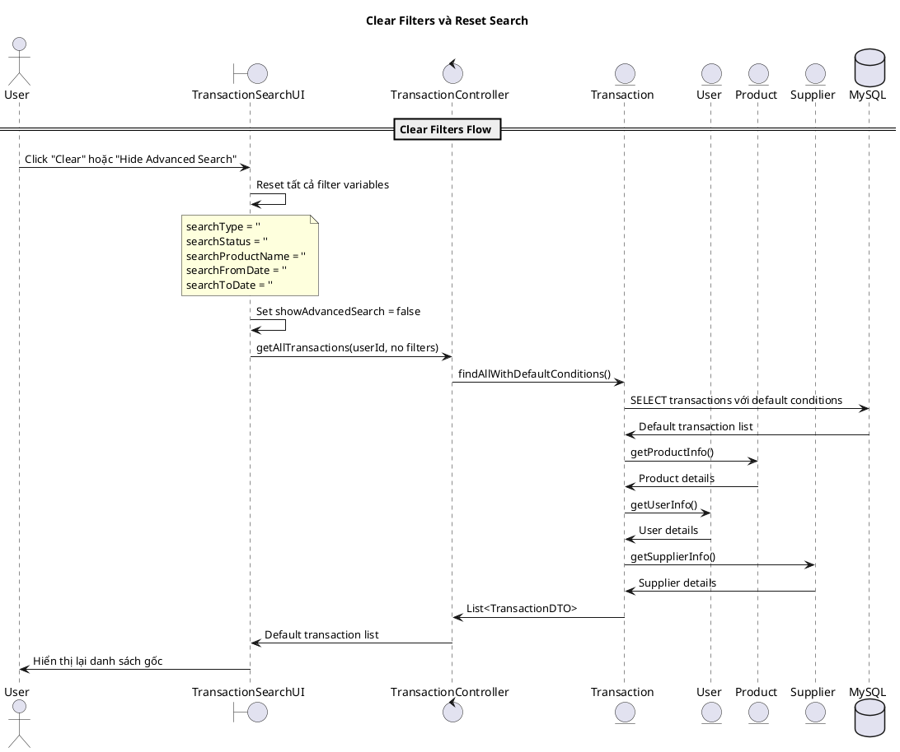
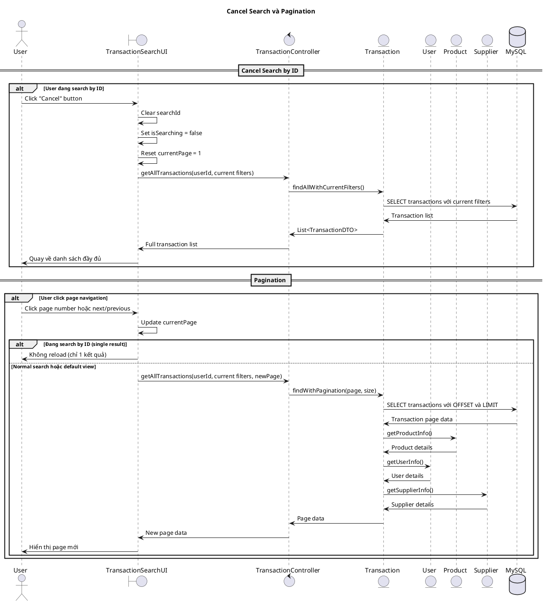
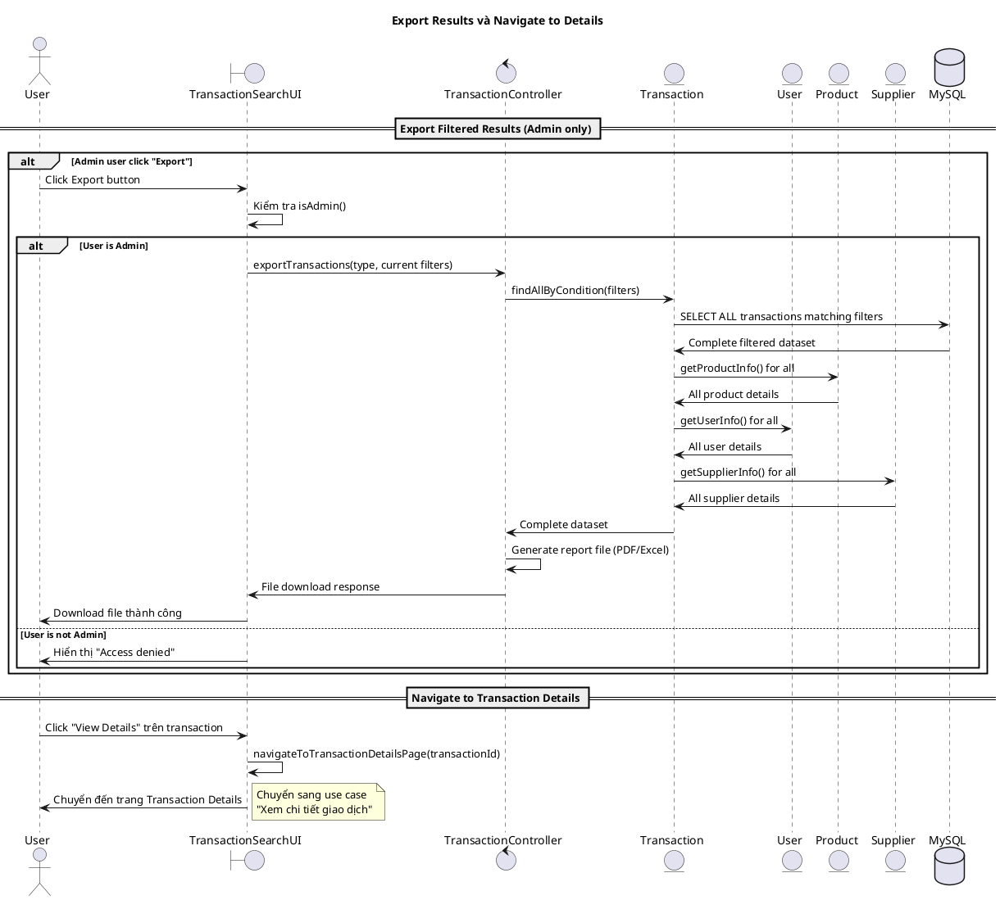

# Biểu đồ trình tự - Use case: Tìm kiếm giao dịch qua điều kiện lọc

## Mô tả
Use case này cho phép người dùng tìm kiếm giao dịch theo nhiều điều kiện khác nhau như: loại giao dịch, trạng thái, tên sản phẩm, khoảng thời gian, và người dùng. Hệ thống cũng hỗ trợ tìm kiếm nhanh theo ID giao dịch và phân trang kết quả.

## 1. Sequence Diagram - Khởi tạo và Load danh sách ban đầu



## 2. Sequence Diagram - Tìm kiếm nhanh theo ID



## 3. Sequence Diagram - Advanced Search với điều kiện lọc



## 4. Sequence Diagram - Clear Filters và Reset



## 5. Sequence Diagram - Cancel Search và Pagination



## 6. Sequence Diagram - Export và Navigate to Details



## Các trường hợp đặc biệt

### 1. Role-based Access Control trong Search
```typescript
// Logic filtering dựa trên role
if (isAdmin()) {
    userId = -1; // Xem tất cả transactions
} else {
    userId = currentUser.id; // Chỉ xem transactions của mình
}

// Trong database query
// ADMIN: không filter by userId
// STOCKSTAFF: filter by user.id = userId OR sender.id = userId  
// CUSTOMER: filter by user.id = userId
// SUPPLIER: filter by supplier.id = currentUser.supplier.id OR status = SENDER_DECIDING
```

### 2. Search Modes
- **Quick Search**: Tìm theo ID, chỉ trả về 1 kết quả
- **Advanced Search**: Tìm theo nhiều điều kiện, có pagination
- **Default View**: Hiển thị tất cả theo role với pagination

### 3. Filter Parameters
```typescript
interface SearchFilters {
    searchType?: 'PURCHASE' | 'SALE' | 'RETURN_TO_SUPPLIER';
    searchStatus?: 'PENDING' | 'COMPLETED' | 'CANCELED' | 'SENDER_DECIDING' | 'ADMIN_DECIDING';
    searchProductName?: string;  // LIKE search
    searchFromDate?: string;     // >= date
    searchToDate?: string;       // <= date
    userId?: number;             // Role-based
    page?: number;               // Pagination
    size?: number;               // Page size
}
```

### 4. Database Query Optimization
- **JOIN Strategy**: LEFT JOIN với product, user, supplier để lấy thông tin liên quan
- **Indexing**: Index trên createdAt, status, transactionType để tăng tốc query
- **Pagination**: Sử dụng OFFSET và LIMIT để giới hạn kết quả
- **Date Filtering**: Sử dụng LocalDateTime comparison

### 5. UI State Management
```typescript
// Search states
isSearching: boolean = false;           // Đang search by ID
showAdvancedSearch: boolean = false;    // Hiển thị advanced form
searchId: string = '';                  // ID search input
currentPage: number = 1;                // Current page number
totalPages: number = 0;                 // Total pages
transactions: Transaction[] = [];       // Result list
```

### 6. Error Handling
- **Empty Search**: Validate input trước khi search
- **No Results**: Hiển thị friendly message
- **Access Denied**: Ẩn transactions không có quyền truy cập
- **Network Error**: Retry mechanism và error notifications

### 7. Performance Considerations
- **Debouncing**: Delay search khi user đang typing
- **Caching**: Cache recent search results
- **Lazy Loading**: Load thêm data khi scroll xuống
- **Query Optimization**: Minimize database calls

## Tích hợp với các Use Case khác
- **Transaction Details**: Navigate khi click "View Details"
- **Export Reports**: Admin có thể export filtered results
- **Real-time Updates**: WebSocket updates cho transaction list
- **Role Management**: Tích hợp với authentication system

## Business Rules
1. **ADMIN**: Có thể search tất cả transactions, có button Export
2. **STOCKSTAFF**: Chỉ search transactions mà họ tạo hoặc được assign
3. **CUSTOMER**: Chỉ search transactions của chính họ
4. **SUPPLIER**: Search transactions liên quan đến supplier của họ
5. **Pagination**: Default 10 items per page, có thể thay đổi
6. **Date Range**: Validation để đảm bảo fromDate <= toDate
7. **Product Search**: Case-insensitive LIKE search