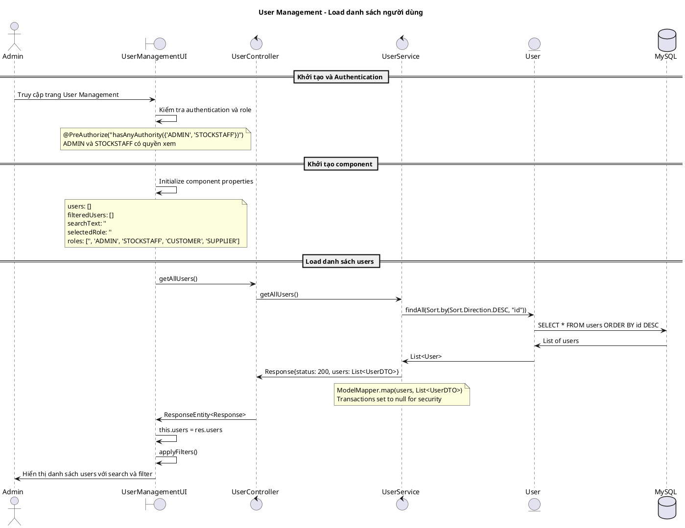
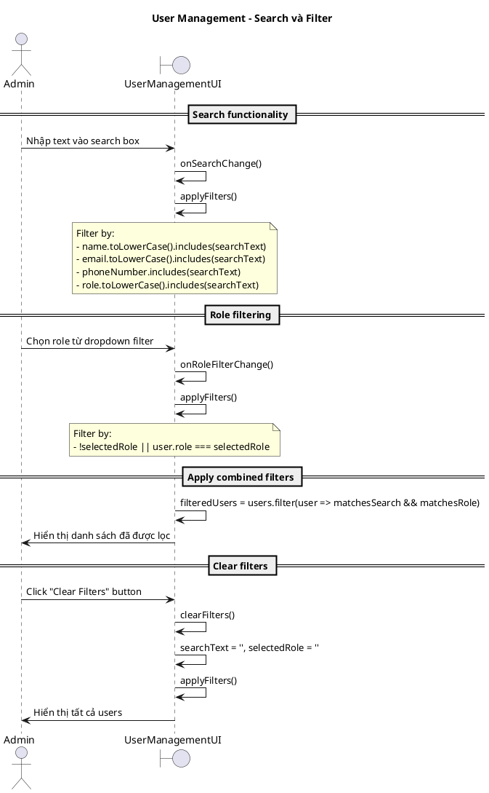
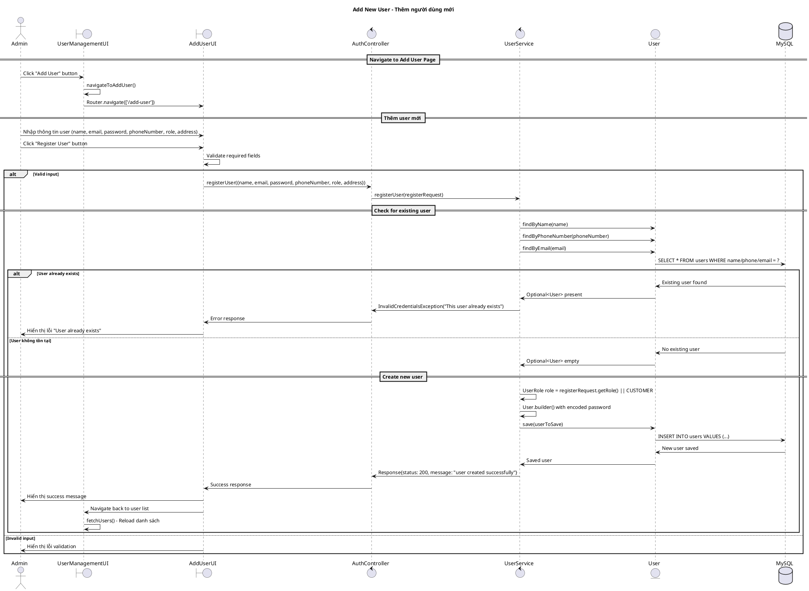
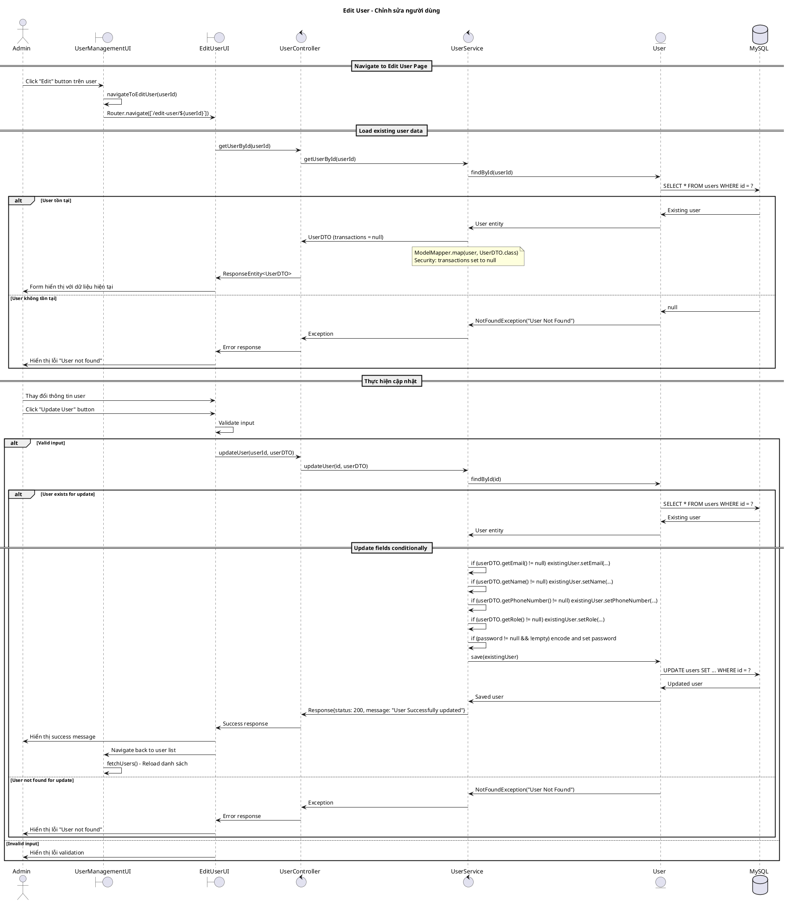
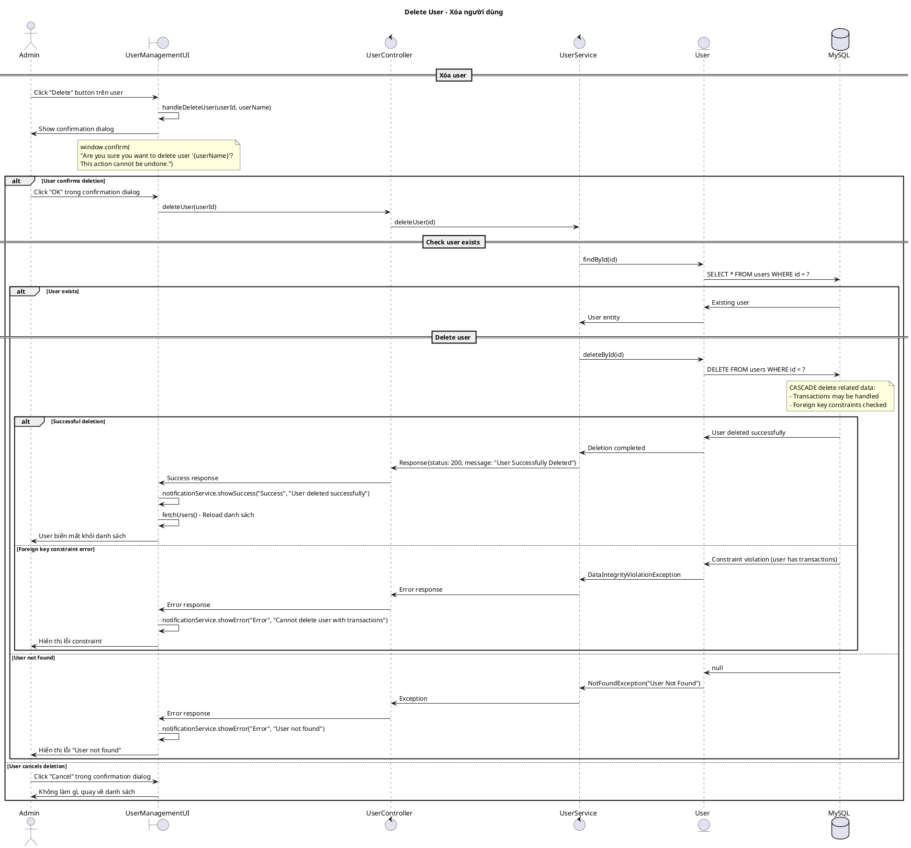
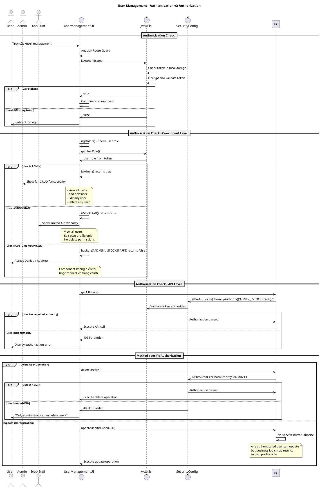
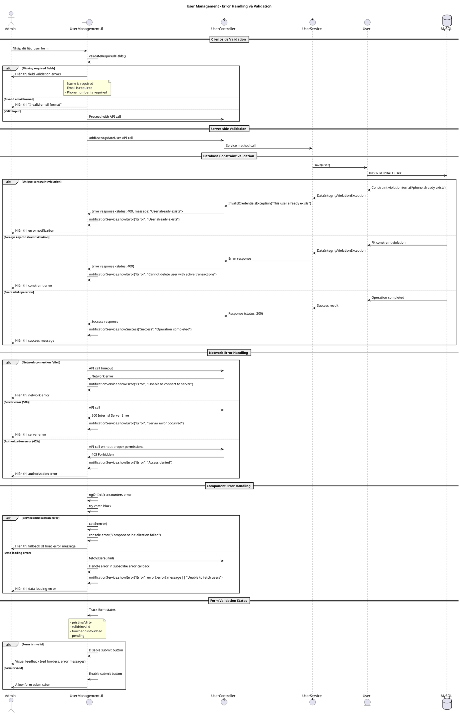

# Biểu đồ trình tự - Use case: Quản lý người dùng (User Management)

## Mô tả
Use case này cho phép Admin và Stock Staff quản lý người dùng trong hệ thống, bao gồm: xem danh sách, tìm kiếm, lọc theo role, thêm mới, chỉnh sửa và xóa người dùng. Hệ thống cũng hỗ trợ authentication, authorization và validation dữ liệu.

## 1. Sequence Diagram - Khởi tạo và Load danh sách người dùng



## 2. Sequence Diagram - Tìm kiếm và lọc người dùng



## 3. Sequence Diagram - Thêm người dùng mới



## 4. Sequence Diagram - Chỉnh sửa người dùng



## 5. Sequence Diagram - Xóa người dùng



## 6. Sequence Diagram - Authentication và Authorization



## 7. Sequence Diagram - Error Handling và Validation



## Các trường hợp đặc biệt

### 1. Authorization và Security
```typescript
// Component level - chỉ ADMIN và STOCKSTAFF có quyền truy cập
isAdmin(): boolean {
  return this.apiService.isAdmin();
}

// API level - different permissions cho different operations
@PreAuthorize("hasAnyAuthority({'ADMIN', 'STOCKSTAFF'})")  // View users
@PreAuthorize("hasAuthority('ADMIN')")  // Delete users
```

### 2. Data Security và Privacy
```java
// Service layer - Remove sensitive data
List<UserDTO> userDTOS = modelMapper.map(users, new TypeToken<List<UserDTO>>() {}.getType());
userDTOS.forEach(userDTO -> userDTO.setTransactions(null));  // Security
```

### 3. Search và Filter Performance
```typescript
// Client-side filtering for better UX
applyFilters(): void {
  this.filteredUsers = this.users.filter(user => {
    const matchesSearch = // Multiple field search
    const matchesRole = // Role-based filtering
    return matchesSearch && matchesRole;
  });
}
```

### 4. User Experience Enhancements
```typescript
// Confirmation dialogs for destructive actions
handleDeleteUser(userId: string, userName: string): void {
  if (window.confirm(`Are you sure you want to delete user "${userName}"?`)) {
    // Proceed with deletion
  }
}

// Role-based UI styling
getRoleBadgeClass(role: string): string {
  const roleClasses = {
    'ADMIN': 'badge badge-danger',
    'STOCKSTAFF': 'badge badge-info',
    'CUSTOMER': 'badge badge-success',
    'SUPPLIER': 'badge badge-secondary'
  };
}
```

### 5. Error Handling Strategies
- **Client-side validation**: Immediate feedback
- **Server-side validation**: Business rule enforcement  
- **Database constraints**: Data integrity protection
- **Network error handling**: Graceful degradation
- **Authorization errors**: Proper access control

### 6. Performance Considerations
- **Pagination**: Có thể implement cho large datasets
- **Caching**: Cache user list để giảm API calls
- **Debouncing**: Cho search input
- **Lazy loading**: Cho user details

### 7. Audit và Logging
- **User actions**: Track who did what when
- **Error logging**: For debugging và monitoring
- **Security events**: Login/logout, permission changes

### 8. Integration Points
- **Authentication service**: JWT token management
- **Notification service**: User feedback
- **WebSocket**: Real-time updates (có thể extend)
- **Email service**: For user notifications